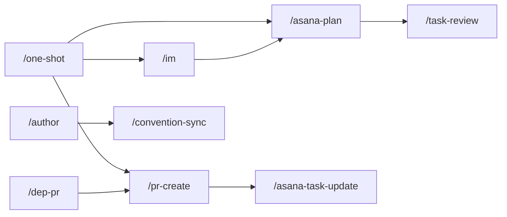

Complete agent-assisted development workflow for Edge repositories — slash skills with companion scripts, coding standards, review standards, and the author skill.

## Installation

**1. Set the required env var** in your `~/.zshrc`:
```bash
export GIT_BRANCH_PREFIX=yourname   # e.g. jon, paul, sam — used for branch naming and PR discovery
```

**2. Install files into `~/.cursor/`:**
```bash
curl -sL https://github.com/EdgeApp/edge-conventions/archive/refs/heads/jon/agents.tar.gz | \
  tar -xz --strip-components=2 -C ~/.cursor 'edge-conventions-jon-agents/.cursor' && \
  find ~/.cursor -type f -name "*.sh" -exec chmod +x {} + && \
  echo "✓ Installed into ~/.cursor/"
```

**3. Verify prerequisites:**
- `gh` CLI — `gh auth login`
- `jq` — `brew install jq`
- `ASANA_TOKEN` env var (Asana scripts only)

---

## Table of Contents

- [Architecture](#architecture)
- [Skills](#skills-slash-skills)
- [Companion Scripts](#companion-scripts)
- [Shared Module](#shared-module-edge-repojs)
- [Rules](#rules-mdc-files)
- [Author Skill](#author-skill)
- [Design Principles](#design-principles)

---

## Architecture

```
.cursor/
├── skills/            # Primary slash skills (*/SKILL.md) + skill scripts
├── scripts/           # Shared utility scripts (status dashboard, portability)
├── commands/          # Minimal legacy command wrappers (if present)
└── rules/             # Coding/review standards (.mdc)
```

**Separation of concerns:**
- **Commands** (`.md`) — Define agent workflows: steps, rules, edge cases. Invoked explicitly via `/command`.
- **Skills** (`SKILL.md`) — Primary workflow units invoked with `/skill-name` (or selected by context).
- **Companion scripts** (`.sh`, `.js`) — Handle deterministic operations: API calls, git ops, JSON processing. Skills call scripts; scripts never call skills.
- **Rules** (`.mdc`) — Persistent coding standards loaded on-demand by file type or command step. Two classes: **editing standards** (loaded when writing code) and **review standards** (loaded during PR review).

All GitHub API operations use **`gh` CLI** (`gh api`, `gh api graphql`, `gh pr`). No raw `curl` + `$GITHUB_TOKEN`.

**User-specific configuration** is driven by the `GIT_BRANCH_PREFIX` env var — set once in `.zshrc`, used by scripts for branch naming (`$GIT_BRANCH_PREFIX/feature-name`) and PR discovery. No hardcoded usernames.

---

## Skills (Slash Skills)

### Core Implementation

| Skill | Description |
|---------|-------------|
| [`/im`](.cursor/skills/im/SKILL.md) | Implement an Asana task or ad-hoc feature/fix with clean, structured commits |
| [`/one-shot`](.cursor/skills/one-shot/SKILL.md) | Legacy-style one-command flow: `/asana-plan` → `/im` → `/pr-create` with default Asana attach/assign |
| [`/pr-create`](.cursor/skills/pr-create/SKILL.md) | Create a PR from the current branch; optional Asana attach/assign flags |
| [`/dep-pr`](.cursor/skills/dep-pr/SKILL.md) | Create dependent Asana tasks and run downstream PR workflow |
| [`/changelog`](.cursor/skills/changelog/SKILL.md) | Update CHANGELOG.md following existing patterns |

### Planning and Context

| Skill | Description |
|---------|-------------|
| [`/asana-plan`](.cursor/skills/asana-plan/SKILL.md) | Build implementation plans from Asana tasks or text/file requirements |
| [`/task-review`](.cursor/skills/task-review/SKILL.md) | Fetch + analyze Asana task context |
| [`/q`](.cursor/skills/q/SKILL.md) | Answer questions before taking action |

### Review and Landing

| Skill | Description |
|---------|-------------|
| [`/pr-review`](.cursor/skills/pr-review/SKILL.md) | Review a PR against coding and review standards |
| [`/pr-address`](.cursor/skills/pr-address/SKILL.md) | Address PR feedback with fixup commits and replies |
| [`/pr-land`](.cursor/skills/pr-land/SKILL.md) | Land approved PRs: prepare, merge, publish, and Asana updates |

### Asana and Utility

| Skill | Description |
|---------|-------------|
| [`/asana-task-update`](.cursor/skills/asana-task-update/SKILL.md) | Generic Asana mutations (attach PR, assign, status/field updates) |
| [`/standup`](.cursor/skills/standup/SKILL.md) | Generate daily standup from Asana + GitHub activity |
| [`/chat-audit`](.cursor/skills/chat-audit/SKILL.md) | Audit chat sessions for workflow/rule issues |
| [`/convention-sync`](.cursor/skills/convention-sync/SKILL.md) | Sync `~/.cursor` changes with the `edge-conventions` repo and update PR description |
| [`/author`](.cursor/skills/author/SKILL.md) | Create/update/debug skills and related scripts/rules |

---

## Companion Scripts

### PR Operations

| Script | What it does | API |
|--------|-------------|-----|
| [`pr-create.sh`](.cursor/skills/pr-create/scripts/pr-create.sh) | Create PR for current branch with repo-template-aligned title/body | `gh pr create` |
| [`pr-address.sh`](.cursor/skills/pr-address/scripts/pr-address.sh) | Fetch unresolved feedback, post replies, resolve threads, mark addressed | `gh api` REST + GraphQL |
| [`github-pr-review.sh`](.cursor/skills/pr-review/scripts/github-pr-review.sh) | Fetch PR context (metadata + patches) and submit reviews | `gh pr view` + `gh api` REST |
| [`github-pr-activity.sh`](.cursor/skills/standup/scripts/github-pr-activity.sh) | List PRs by activity (recent reviews, comments, CI status) | `gh api graphql` |

### PR Status Dashboard

| Script | What it does | API |
|--------|-------------|-----|
| [`pr-status-gql.sh`](.cursor/scripts/pr-status-gql.sh) | PR status with review state, CI checks, new comments (primary) | `gh api graphql` |
| [`pr-status.sh`](.cursor/scripts/pr-status.sh) | Same as above, REST fallback | `gh api` REST |
| [`pr-watch.sh`](.cursor/scripts/pr-watch.sh) | TUI wrapper — auto-refresh dashboard with rate limit awareness | Delegates to above |

### PR Landing Pipeline (`/pr-land`)

These scripts run sequentially. Each handles one phase of the landing workflow:

| Script | Phase | What it does | API |
|--------|-------|-------------|-----|
| [`pr-land-discover.sh`](.cursor/skills/pr-land/scripts/pr-land-discover.sh) | 1: Discovery | Find all `$GIT_BRANCH_PREFIX/*` PRs with approval status | Single `gh api graphql` query |
| [`pr-land-comments.sh`](.cursor/skills/pr-land/scripts/pr-land-comments.sh) | 2: Comment check | Detect unaddressed feedback (inline threads, review bodies, top-level comments) | `gh api graphql` per PR |
| [`pr-land-prepare.sh`](.cursor/skills/pr-land/scripts/pr-land-prepare.sh) | 3: Prepare | Autosquash → rebase → conflict detection → verification | Git only |
| [`verify-repo.sh`](.cursor/skills/verify-repo.sh) | 3b: Verify | CHANGELOG validation + `prepare`/`tsc`/`lint`/`test` | Git + yarn |
| [`pr-land-merge.sh`](.cursor/skills/pr-land/scripts/pr-land-merge.sh) | 5: Merge | Sequential merge with auto-rebase, mandatory verification | `gh api` REST |
| [`pr-land-publish.sh`](.cursor/skills/pr-land/scripts/pr-land-publish.sh) | 6: Publish | Version bump, changelog update, commit + tag (no push) | Git + npm |

**Conflict handling is fully scripted:**
- Code conflicts → skip PR, continue with remaining
- CHANGELOG-only (including staging) → agent resolves semantically, re-runs

### Chat Analysis

| Script | What it does |
|--------|-------------|
| [`cursor-chat-extract.js`](.cursor/skills/chat-audit/scripts/cursor-chat-extract.js) | Parse Cursor chat export JSON into compact structured summary (messages, tool calls, stats) |

### Asana Integration

| Script | What it does | API |
|--------|-------------|-----|
| [`asana-get-context.sh`](.cursor/skills/asana-get-context.sh) | Fetch task details, attachments, subtasks, custom fields | Asana REST |
| [`asana-task-update.sh`](.cursor/skills/asana-task-update/scripts/asana-task-update.sh) | Generic task updates (attach PR, assign, status, fields) | Asana REST |
| [`asana-create-dep-task.sh`](.cursor/skills/dep-pr/scripts/asana-create-dep-task.sh) | Create dependent task in another repo's project | Asana REST |
| [`asana-whoami.sh`](.cursor/skills/asana-whoami.sh) | Get current Asana user info | Asana REST |

### Build & Deps

| Script | What it does |
|--------|-------------|
| [`lint-commit.sh`](.cursor/skills/lint-commit.sh) | ESLint `--fix`, localize, graduate warnings, and report effective commit scope before commit |
| [`lint-warnings.sh`](.cursor/skills/im/scripts/lint-warnings.sh) | Run `eslint --fix`, then summarize any remaining lint findings with matched fix patterns |
| [`install-deps.sh`](.cursor/skills/install-deps.sh) | Install dependencies and run prepare script |
| [`upgrade-dep.sh`](.cursor/skills/pr-land/scripts/upgrade-dep.sh) | Upgrade a dependency in the GUI repo |

### Sync & Portability

| Script | What it does |
|--------|-------------|
| [`convention-sync.sh`](.cursor/skills/convention-sync/scripts/convention-sync.sh) | Diff and sync `~/.cursor/` files with the edge-conventions repo |
| [`tool-sync.sh`](.cursor/scripts/tool-sync.sh) | Sync Cursor rules, skills, and scripts to OpenCode and Claude Code formats |
| [`port-to-opencode.sh`](.cursor/scripts/port-to-opencode.sh) | Convert Cursor `.mdc`/`.md` files to OpenCode-compatible JSON + MD mirrors |

---

## Dependency Graph

### Skill → Skill



Skills with no skill dependencies:

- `/asana-task-update`
- `/task-review`
- `/q`
- `/pr-review`
- `/pr-address`
- `/pr-land`
- `/standup`
- `/chat-audit`
- `/changelog`
- `/convention-sync`

### Full Skill/Script Dependency Graph

Top-to-bottom organization: skill layer, skill-specific scripts, shared scripts.

```mermaid
graph TD
  subgraph skillLayer [Skills]
    im["/im"]
    oneShot["/one-shot"]
    asanaPlan["/asana-plan"]
    taskReview["/task-review"]
    depPr["/dep-pr"]
    prCreate["/pr-create"]
    asanaTaskUpdate["/asana-task-update"]
    prLand["/pr-land"]
    prReview["/pr-review"]
    prAddress["/pr-address"]
    standup["/standup"]
    chatAudit["/chat-audit"]
    conventionSync["/convention-sync"]
    author["/author"]
    q["/q"]
    changelog["/changelog"]
  end

  subgraph skillScripts [Skill Scripts]
    prCreateSh["pr-create.sh"]
    prAddressSh["pr-address.sh"]
    prReviewSh["github-pr-review.sh"]
    depTaskSh["asana-create-dep-task.sh"]
    asanaTaskUpdateSh["asana-task-update.sh"]
    prLandDisc["pr-land-discover.sh"]
    prLandCmts["pr-land-comments.sh"]
    prLandPrep["pr-land-prepare.sh"]
    prLandMerge["pr-land-merge.sh"]
    prLandPublish["pr-land-publish.sh"]
    prLandExtract["pr-land-extract-asana-task.sh"]
    standupAsana["asana-standup.sh"]
    standupGh["github-pr-activity.sh"]
    chatExtract["cursor-chat-extract.js"]
    conventionSyncSh["convention-sync.sh"]
    generateClaude["generate-claude-md.sh"]
    lintWarn["lint-warnings.sh"]
  end

  subgraph sharedScripts [Shared Scripts]
    lintCommit["lint-commit.sh"]
    verifyRepo["verify-repo.sh"]
    asanaGetContext["asana-get-context.sh"]
    asanaWhoAmI["asana-whoami.sh"]
    installDeps["install-deps.sh"]
    edgeRepo["edge-repo.js"]
  end

  oneShot --> asanaPlan
  oneShot --> im
  oneShot --> prCreate
  asanaPlan --> taskReview
  im --> asanaPlan
  depPr --> prCreate
  prCreate --> asanaTaskUpdate
  author --> conventionSync

  prCreate --> prCreateSh
  prCreate --> verifyRepo
  prCreate --> asanaTaskUpdateSh
  im --> lintWarn
  im --> lintCommit
  im --> verifyRepo
  im --> installDeps
  depPr --> depTaskSh
  depPr --> asanaGetContext
  asanaTaskUpdate --> asanaTaskUpdateSh
  taskReview --> asanaGetContext
  prAddress --> prAddressSh
  prAddress --> lintCommit
  prReview --> prReviewSh
  prLand --> prLandDisc
  prLand --> prLandCmts
  prLand --> prLandPrep
  prLand --> prLandMerge
  prLand --> prLandPublish
  prLand --> prLandExtract
  prLand --> asanaTaskUpdateSh
  prLand --> verifyRepo
  standup --> standupAsana
  standup --> standupGh
  chatAudit --> chatExtract
  conventionSync --> conventionSyncSh
  conventionSync --> generateClaude

  depTaskSh --> asanaWhoAmI
  depTaskSh --> asanaTaskUpdateSh
  asanaTaskUpdateSh --> asanaWhoAmI
  standupAsana --> asanaWhoAmI
  prLandPrep --> edgeRepo
  prLandMerge --> edgeRepo
  prLandPublish --> edgeRepo
```



---

## Shared Module: `edge-repo.js`

[`edge-repo.js`](.cursor/skills/pr-land/scripts/edge-repo.js) eliminates duplication across the `pr-land-*` scripts. Exports:

| Function | Purpose |
|----------|---------|
| `getRepoDir(repo)` | Resolve local checkout path (`~/git/`, `~/projects/`, `~/code/`) |
| `getUpstreamBranch(repo)` | `origin/develop` for GUI, `origin/master` for everything else |
| `runGit(args, cwd, opts)` | Safe `spawnSync` wrapper with `GIT_EDITOR=true` |
| `parseConflictFiles(output)` | Extract conflicting file paths from rebase output |
| `isChangelogOnly(files)` | Check if all conflicts are in CHANGELOG.md |
| `runVerification(repoDir, baseRef, opts)` | Run the full verify script with scoped lint (supports `{requireChangelog: true}`) |
| `ghApi(endpoint, opts)` | `gh api` wrapper with method, body, paginate, jq support |
| `ghGraphql(query, vars)` | `gh api graphql` wrapper with typed variable injection |

---

## Rules (`.mdc` files)

| Rule | Activation | Purpose |
|------|-----------|---------|
| [`typescript-standards.mdc`](.cursor/rules/typescript-standards.mdc) | Loaded before editing `.ts`/`.tsx` files | TypeScript + React coding standards for **editing** (includes `simple-selectors` rule, descriptive variable names, biggystring arithmetic) |
| [`review-standards.mdc`](.cursor/rules/review-standards.mdc) | Loaded by `/pr-review` command | ~50 review-specific diagnostic rules extracted from PR history |
| [`load-standards-by-filetype.mdc`](.cursor/rules/load-standards-by-filetype.mdc) | Always applied | Auto-loads language-specific standards before editing |
| [`fix-workflow-first.mdc`](.cursor/rules/fix-workflow-first.mdc) | Always applied | Fix command/skill definitions before patching downstream symptoms |
| [`answer-questions-first.mdc`](.cursor/rules/answer-questions-first.mdc) | Always applied | Detect `?` in user messages → answer before acting; loads active command context to evaluate workflow gaps |
| [`no-format-lint.mdc`](.cursor/rules/no-format-lint.mdc) | Always applied | Don't manually fix formatting — auto-format on agent finish handles it |
| [`eslint-warnings.mdc`](.cursor/rules/eslint-warnings.mdc) | `.ts`/`.tsx` files | ESLint warning handling patterns |

**Editing vs. review separation**: `typescript-standards` contains rules for writing code (prefer `useHandler`, use `InteractionManager`, descriptive variable names, biggystring for numeric calculations). `review-standards` contains diagnostic patterns for catching bugs during review (null `tokenId` fallback, stack trace preservation, module-level cache bugs, etc.). Both are loaded together during `/pr-review`; only `typescript-standards` is loaded during editing.

---

## Author Skill

| Skill | Purpose |
|-------|---------|
| [`author/SKILL.md`](.cursor/skills/author/SKILL.md) | Meta-skill for creating/maintaining skills, scripts, and rules. Enforces XML format, `scripts-over-reasoning`, `gh-cli-over-curl`, dependency-audit requirements before script add/update/remove, and convention-sync/CLAUDE sync post-authoring behavior. |

---

## Design Principles

1. **Scripts over reasoning** — Deterministic operations (API calls, git, JSON) go in companion scripts, not inline in commands.
2. **`gh` CLI over `curl`** — All GitHub API calls use `gh api` / `gh api graphql`. Handles auth, pagination, API versioning automatically.
3. **GraphQL over REST** — Fetch only required fields in a single request where possible. Fall back to REST only when GraphQL doesn't expose the needed data (e.g., file patches).
4. **DRY shared modules** — Common utilities extracted into `edge-repo.js` rather than duplicated across scripts.
5. **XML format** — Skills use XML structure (`<goal>`, `<rules>`, `<step>`) for reliable LLM instruction-following.
6. **Standards-first** — Load coding standards before writing or reviewing any code.
7. **Fix workflow first** — When behavior is wrong, fix the command/skill definition, not the downstream symptom.
8. **No hardcoded usernames** — All user-specific values come from `GIT_BRANCH_PREFIX` env var, set once in `.zshrc`.
9. **Minimize context** — Script output must be compact and structured. Never return raw API responses. Every token costs context.
10. **Small-model conventions** — High-frequency skills that run on faster/cheaper models use verbatim bash, file-over-args, inline guardrails, and explicit parallel instructions for reliability.
11. **Knowledge base over crawling** — Maintain curated knowledge files (e.g., `eslint-warnings.mdc`) instead of having the agent crawl/grep for information repeatedly. Pre-indexed knowledge reduces tool calls and context consumption.
12. **Continuous improvement** — Workflows feed back into their own knowledge. PR review feedback updates `review-standards.mdc`, addressed warnings update `eslint-warnings.mdc`, and chat audits surface rule gaps. Each cycle reduces repetitive context gathering by the agent and repetitive review by humans.
