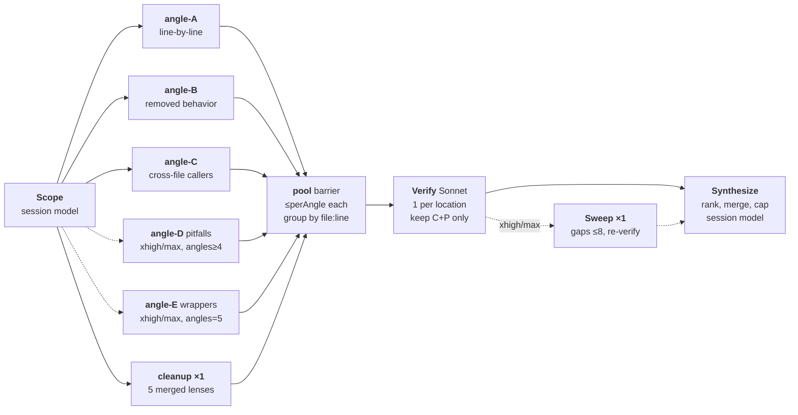

# code-review-sonnet: fan-out anatomy

The engine behind /pr-review's deep mode (`~/.claude/workflows/code-review-sonnet.js`,
level-parity re-pin from Claude Code 2.1.232). The typed level picks the pipeline
shape and, by default, the fan-out agents' reasoning effort. Three dials move
independently of it: `angles=N` widens or narrows the correctness fan-out,
`model=X` moves the fan-out off pinned Sonnet, and `effort=X` moves the fan-out
effort off the level's default. `inherit` on either of the last two drops that key
entirely, so the fan-out takes the caller's own model or effort the way Scope and
Synthesize always have.

All finder/verifier/sweep agents run pinned Sonnet at the level's effort unless
`model=`/`effort=` says otherwise; Scope and Synthesize inherit the session model.
Dashed = level-gated. Synthesize does not run at `low` (see the reading notes).

Per-level dials (`LEVEL_PARAMS`):

| Level | Effort (fan-out) | Correctness angles | Cands/angle | Verify | Sweep | Report cap |
|---|---|---|---|---|---|---|
| low | medium (sonnet quirk) | single-pass: 1 finder, all lenses | 8 total | none | no | 4 |
| medium | medium | 3 (A-C) | 6 | plain ladder | no | 8 |
| high | high | 3 (A-C) | 6 | recall-biased | no | 10 |
| xhigh | xhigh | 5 (A-E) | 8 | recall-biased | yes | 15 |
| max | max | 5 (A-E) | 8 | recall-biased | yes | 15 |

Reading notes:

- An angle is a finder's assigned lens; each correctness angle is its own parallel
  agent. `angles=N` (1-5) moves the A-E cutoff independently of level.
- Cleanup stays ONE merged finder whose candidate budget (5×perAngle) matches the
  official build's five separate cleanup-family finders — the clone's one structural
  divergence.
- Verifier count tracks distinct (file,line) locations, not finder count. Grouping is
  not dedup: every candidate keeps its own verdict; semantic merging happens in
  Synthesize. A location's verifier dying drops that location's candidates rather
  than passing them unverified.
- Verify framing: medium judges on the plain verdict ladder (precision); high and
  above add the recall bias.
- Low is the official single-pass cell: no fan-out, no verify, precision by
  construction. Synthesis is skipped there too — one finder cannot produce
  cross-finder duplicates, there are no verdicts to weigh, and the cap is 4, so
  the assembler's own ranking is the whole job. That leaves low at ONE agent of
  review work (Scope still runs to pin the diff and the applicable CLAUDE.md files).
- Low's `medium` effort is a SONNET compensation carried over from the official
  cell, whose stated premise is that the fan-out is sonnet. That premise HOLDS on
  both of our surfaces: /pr-review never passes `model=`, and the `agent_review`
  field resolves to a bare level, so the fan-out is pinned Sonnet either way and
  low at medium effort is correct rather than an accident.
- `model=` and `effort=` therefore change nothing unless a caller types them. They
  exist for the case the compensation was never meant to cover: once the fan-out is
  NOT sonnet, low-at-medium-effort has no premise left, and `effort=inherit` is how
  such a call runs as its caller runs. No default path passes either token.
- Not cloned: ultra (cloud, user-triggered), the diff-size finder-budget hint,
  non-sonnet per-model prompt cells.
