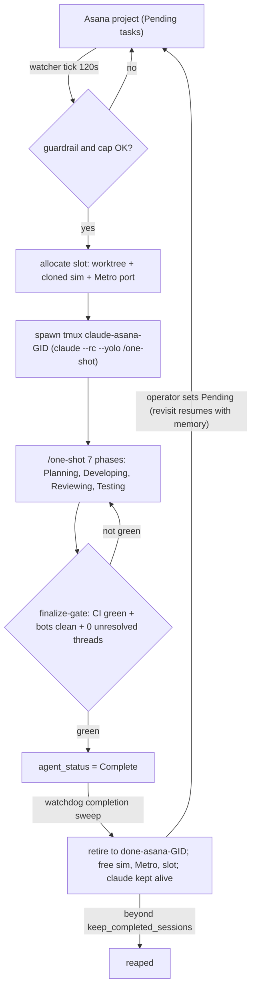
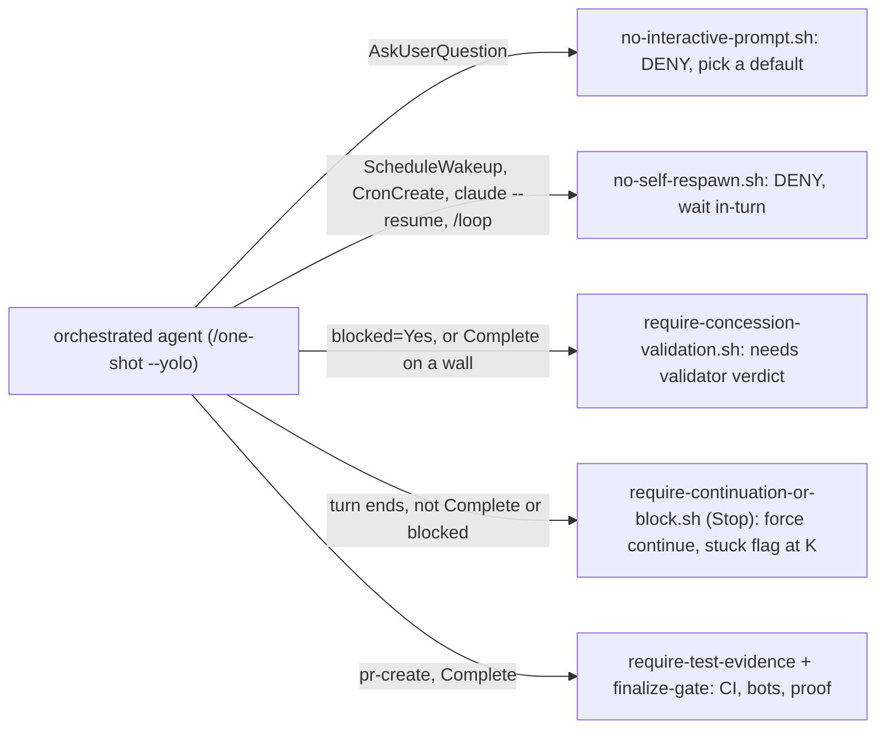

# edge-dev-agents

Complete agent-assisted development workflow for Edge repositories:
slash skills, companion scripts, coding standards, review standards,
and meta-tooling for maintaining the workflow itself.

The distributable Cursor content lives under `.cursor/`. This repo is the
versioned home for those skills, rules, scripts, and docs.

The canonical local doc lives at `~/.cursor/README.md`. During
`/convention-sync`, that file is mirrored to `edge-dev-agents/README.md`, and
the repo copy should not keep a second `.cursor/README.md`.

## Installation

**Fresh machine (one command):** clone this repo and run the bootstrap — it
installs everything (cursor skills/rules, the orchestration system, and shared
memories) into your home dir, seeds `credentials.json` from the example, and
links skills + shared memory:

```bash
git clone <this-repo> ~/git/edge-dev-agents && cd ~/git/edge-dev-agents && ./bootstrap.sh
# then edit ~/.config/agent-watcher/credentials.json with your real asana_token
```

For incremental onboarding instead of the full bootstrap:

**1. Set the required env var** in your `~/.zshrc`:

```bash
export GIT_BRANCH_PREFIX=yourname   # e.g. jon, paul, sam
```

This drives branch naming and PR discovery across the workflow.

**2. Sync the repo copy into `~/.cursor/`:**

This repo treats `~/.cursor/` as the canonical working copy. Use
`/convention-sync` to move local changes into `edge-dev-agents`, or run the
companion script directly when onboarding:

```bash
~/.cursor/skills/convention-sync/scripts/convention-sync.sh \
  --repo-to-user --stage
```

**3. Verify prerequisites:**

- `gh` CLI: `gh auth login`
- `jq`: `brew install jq`
- `ASANA_TOKEN` env var for Asana-backed workflows

## Table of Contents

- [Architecture](#architecture)
- [Orchestration & Memory](#orchestration--memory)
- [Skills](#skills-slash-skills)
- [Companion Scripts](#companion-scripts)
- [Shared Modules](#shared-modules)
- [Rules](#rules-mdc-files)
- [Design Principles](#design-principles)

## Orchestration & Memory

The orchestration system runs Asana tasks to PRs autonomously: a watcher picks up
`Pending` tasks, spawns one isolated agent session per task, and a watchdog tends
the live sessions. Post-hoc evals grade what each run did.

### How a run flows

At a glance:



#### 1. Watcher: spawn and resume

`agent-watcher/asana-watcher.js`, launchd every 120s, polls the project for
`agent_status = Pending`.

- **Tick gate.** The tick is skipped when a resource guardrail trips (1-minute
  load over `max_load_avg`, free RAM under `min_free_ram_gb`) or the
  concurrency cap is full (`max_concurrent`, default 4).
- **Provisioning.** Each pickable task gets a slot: a git worktree, a cloned
  simulator from the pool, and a Metro port. Before recloning the pool the
  watcher runs `refresh-master-build.sh`: if `develop` advanced AND its native
  side (`ios/Podfile.lock`) changed, the master sim is rebuilt from `develop`
  and the pool recloned, so runs test against a current build. A JS-only
  advance skips the rebuild (clones bundle JS live from Metro). The check is a
  cheap `git fetch` plus SHA compare; a build failure is non-fatal
  (provisioning continues on the last-good master).
- **Fresh vs revisit.** A never-run task spawns fresh: `agent_status =
  Planning`, a tmux session `claude-asana-(gid)` running `/one-shot --yolo
  (task-url)`. A task with a prior transcript is RESUMED instead, on a fresh
  slot, via `resume-task`. Re-engaging a finished task is therefore one
  signal: set it back to `Pending`.
- **Resume compaction, and why finalize is gated.** The resume auto-answers
  the resume menu with "Resume from summary", which COMPACTS the conversation
  from a summary built before the re-arm, so a resumed agent's memory never
  contains the followup comment that triggered it. The counter is mechanical:
  `check-followup-scope.sh` live-fetches comments and attachments, lists every
  operator comment newer than the latest `agent-run-report*.md` watermark, and
  writes a marker; the `require-followup-scope-on-complete.sh` hook blocks
  `Complete` unless that marker exists and still matches the live newest
  comment. Recalled context never stands in for the fetch.
- **Per-task model and effort.** Both spawn and resume route through
  `spawn-test-session.sh`, which pins the session model and reasoning effort
  from the task's `agent_model` / `agent_effort` Asana fields (models all
  1M-context: Fable 5, Opus 4.8, Opus 4.7, Sonnet 5, Sonnet 4.6; effort
  low/medium/high/xhigh/max). Unset falls back to config defaults
  (`.watcher.agent_model` = Opus 4.8 1M, `.watcher.agent_effort` = high).
- **Version stamp.** Every spawn and resume segment records which orch version
  governs it: `stamp-orch-version.sh` appends content digests of the governing
  trees (skills, rules, watcher, hooks, settings hooks) plus repo head, CLI
  version, model, and effort to `versions/(gid).jsonl`, and exports
  `AGENT_ORCH_VERSION` for the run report. Evals slice findings by the version
  actually in force per segment.

#### 2. The run

`/one-shot --yolo`, a single agent turn: seven phases with `agent_status`
advanced via `update-status.sh` at each boundary. Planning (`/asana-plan`),
Developing (`/im`), Testing (`/build-and-test`, on-sim verification), Reviewing
(`/pr-create` through the CI + reviewer-bot watch), Complete. Status LEADS the
work: the phase status is set when that kind of work starts, never as a side
effect of a terminal action. The agent runs hands-off: no interactive prompts,
no self-respawn, every wait a bounded blocking in-turn call. The full decision
graph, including followup, concession, landing, and cheese branches, is in the
[/one-shot decision flowchart](#one-shot-decision-flowchart) below.

#### 3. Finalize: gate, land, or cheese

`Complete` requires the finalize gate: every primary PR CI-green, every
reviewer bot clean on HEAD, zero unresolved bot review threads (bots matched by
GraphQL `__typename == "Bot"`). At green, landability is decided FIRST: a PR
with a human APPROVED review (or the task's Force Land field) lands via
`/pr-land` and the Build field is ignored. Only a non-landable green run kicks
a cheese build, pinning the task's own unpublished dep PRs when the deliverable
requires them.

#### 4. Watchdog

`agent-watcher/session-watchdog.js`, launchd every 120s, tends live sessions:

- RC-bridge revive (only when the bridge is dead)
- completion sweep: `Complete` retires `claude-asana-(gid)` to
  `done-asana-(gid)`, frees sim/Metro/slot, keeps claude alive for
  re-engagement
- blocked sweep: sheds sim/Metro while a human is needed
- GC: keep newest `keep_completed_sessions` / `keep_completed_worktrees`
- orphan-Metro reap, idle-dirty-sim reclaim, and operator escalation for
  parked prompts or stuck sessions

It does NOT re-engage finished tasks: that is the watcher's job (Pending
resumes), so watchdog and watcher stay decoupled.

#### 5. Hands-off enforcement (hooks)

The hands-off contract is enforced by deterministic PreToolUse and Stop hooks
(active only when `AGENT_TASK_GID` is set), not merely documented:



#### 6. Eval

Post-hoc, per run or per cohort: `/resolve-run` builds an evidence manifest
(transcript, PRs, Asana state, attempt log, friction block, version stamps);
`/agent-eval` grades process compliance and outcome honesty, `/orch-eval`
grades infrastructure health, `/eval-run` orchestrates a cohort with
adversarial verification. Between cohorts, `friction-scorecard.sh` prints a
zero-LLM trend table (hook blocks, tool errors, builds, compactions, drives,
attempt walls) straight from the manifests.

### /one-shot decision flowchart

The full decision flow of an orchestrated `/one-shot --yolo` run, including the
followup, concession, landing, and cheese branches. Rule ids in brackets name
the governing one-shot/cheese/build-and-test rules.

```mermaid
flowchart TD
  START["/one-shot --yolo task-url"] --> REFIRE{"re-fire? task already
  ran in this session"}
  REFIRE -- "no (fresh or resumed-new)" --> PLAN
  REFIRE -- "yes, still mid-run" --> CONT["continue current phase
  [ignore-refired-one-shot]"]
  REFIRE -- "yes, previously FINISHED" --> SCOPE["LIVE scope check:
  check-followup-scope.sh
  (never from memory)"]
  SCOPE -- "operator asks newer
  than report watermark" --> FOLLOWUP["deliver the new scope
  [followup-scope-is-the-deliverable]"]
  FOLLOWUP --> DEV
  SCOPE -- "0 newer comments" --> GATE

  PLAN["Planning: /asana-plan, plan doc
  (confirmation waived in yolo)"] --> DEV
  DEV["Developing: /im contract
  (lint-warnings, lint-commit,
  clean history)"] --> TEST
  TEST["Testing: slot-preflight -> obey PLAN/INVOKE
  -> build -> drive the REAL action on sim
  (log-attempt every drive, pixel-verify proofs)
  [preflight-before-build-decisions]"] --> WALL{"hit a wall?"}
  WALL -- no --> PR
  WALL -- yes --> ATTEMPT["log the attempt
  (failed:/blocked:/loss:)"] --> VALID{"concession-validator
  verdict [yolo-true-blockers]"}
  VALID -- "legitimate: true" --> BLOCKED["blocked = Yes, park
  (one-line comment, NO report doc)"]
  VALID -- "legitimate: false" --> RETRY["do what_to_try, continue"] --> TEST

  PR["Reviewing: /pr-create (verify green, clean tree,
  template, evidence; Asana attach; multi-repo
  subtasks; draft dep PRs excluded from gate)"] --> WATCH
  WATCH["watch-pr bounded poll; bots must be
  SUCCESS (NEUTRAL = findings -> /bugbot);
  fixes via amend + force-with-lease"] --> GATE
  GATE{"finalize-gate green:
  CI + every bot clean +
  0 unresolved bot threads
  on EVERY primary PR"}
  GATE -- "not green" --> WATCH
  GATE -- green --> LAND{"landable? human APPROVED
  review (any point in history)
  OR Force Land field
  [land-on-approval]"}

  LAND -- yes --> PRLAND["/pr-land with TASK URL
  (dep ordering: merge dep -> publish ->
  bump -> gui; npm OTP parks at
  operator boundary). Build field IGNORED
  -> NO cheese push"] --> REPORT
  LAND -- no --> BUILDF{"Build field?
  [cheese-build-on-green]"}
  BUILDF -- none --> REPORT
  BUILDF -- staging --> REPORT
  BUILDF -- "cheese (feta/gouda/...)" --> PINQ{"gui deliverable requires
  unpublished dep PRs?"}
  PINQ -- yes --> PINNED["/cheese --pin each dep
  at ITS PR head
  [cheese:orch-pins-required]"] --> REPORT
  PINQ -- no --> POINTER["/cheese pointer reset
  test-branch -> PR head"] --> REPORT

  REPORT["RE-READ report template -> write report
  -> require-clean-run-report lint at attach
  -> set tested field from THIS run's evidence"] --> COMPLETE
  COMPLETE["agent_status = Complete
  (gated: fresh followup-scope check
  required by hook)"]
```



Status discipline throughout: the phase status is set when that KIND of work
starts (status leads the work), never as a side effect of a terminal action.

### Distribution (what syncs)

Beyond cursor skills/rules, this repo mirrors two more portable trees so a
second Mac is reproducible from a single clone + `./bootstrap.sh`:

- **`agent-watcher/`** — the autonomous agent orchestration system (Asana
  watcher daemon + worktree/iOS-sim pool helpers + watchdog). Canonical home is
  `~/.config/agent-watcher` (XDG config; `~/.agents` is not an established
  standard). Committed: scripts, `*.js`, `asana-config.json`, `README.md`,
  `oom-repro/HANDOFF.md`+`scripts/`, and `credentials.example.json`. **Never
  committed:** `credentials.json` (secret) and machine-local state
  (`pool.json`, `slots.json`, `watchdog-state.json`, `*.state`, `*.log`,
  `oom-repro/forensics`, `oom-repro/logs`).
- **`memory-shared/`** + **`bin/link-shared-memory.sh`** — cross-cutting Claude
  memory notes that should surface regardless of working directory. Canonical
  home `~/.claude/memory-shared`; `link-shared-memory.sh` symlinks them into the
  per-project auto-memory dirs (`~/.claude/projects/<project>/memory/`) and
  maintains a managed block in each `MEMORY.md`. Claude auto-memory itself is
  machine-local (per Anthropic docs) and is intentionally NOT synced — only the
  shared store is. The only officially global Claude file is `~/.claude/CLAUDE.md`
  (generated here from always-apply rules).

`/convention-sync` keeps all of the above in sync (home → repo); `bootstrap.sh`
does the reverse (repo → home) on a new machine.

## Architecture

```text
edge-dev-agents/
├── README.md          # Synced copy of ~/.cursor/README.md
└── .cursor/
    ├── skills/        # Slash skills (*/SKILL.md) + companion scripts
    ├── scripts/       # Shared portability and dashboard scripts
    ├── commands/      # Minimal command wrappers
    └── rules/         # Coding and workflow standards (.mdc)
```

**Separation of concerns:**

- **Skills** (`SKILL.md`) define workflows, rules, and step ordering.
- **Companion scripts** (`.sh`, `.js`) handle deterministic work like git,
  GitHub, Asana, and JSON processing.
- **Rules** (`.mdc`) provide persistent guidance that gets loaded by context.
- **Repo docs** describe the system and how the distribution copy fits
  together.

All GitHub API work uses `gh` CLI. Deterministic git operations should live in
scripts, not be re-described independently across skills.

## Skills (Slash Skills)

### Core Implementation

| Skill | Description |
|------|-------------|
| [`/im`](.cursor/skills/im/SKILL.md) | Implement an Asana task or ad-hoc feature/fix with clean, structured commits |
| [`/one-shot`](.cursor/skills/one-shot/SKILL.md) | Legacy-style task-to-PR flow built from planning, implementation, and PR creation |
| [`/pr-create`](.cursor/skills/pr-create/SKILL.md) | Create a PR from the current branch with repo-aligned title and body |
| [`/dep-pr`](.cursor/skills/dep-pr/SKILL.md) | Create dependent Asana tasks and downstream PR work in another repo |
| [`/changelog`](.cursor/skills/changelog/SKILL.md) | Update CHANGELOG entries using repo conventions |

### Planning and Context

| Skill | Description |
|------|-------------|
| [`/asana-plan`](.cursor/skills/asana-plan/SKILL.md) | Build an implementation plan from Asana or ad-hoc requirements |
| [`/task-review`](.cursor/skills/task-review/SKILL.md) | Fetch and summarize Asana task context |
| [`/q`](.cursor/skills/q/SKILL.md) | Answer questions before taking action |

### Review and Landing

| Skill | Description |
|------|-------------|
| [`/pr-review`](.cursor/skills/pr-review/SKILL.md) | Review a PR against coding and review standards |
| [`/pr-address`](.cursor/skills/pr-address/SKILL.md) | Address PR feedback with fixup commits, replies, and optional autosquash |
| [`/pr-land`](.cursor/skills/pr-land/SKILL.md) | Land approved PRs, including prepare, merge, publish, GUI dep updates, staging cherry-picks, and Asana updates |
| [`/staging-cherry-pick`](.cursor/skills/staging-cherry-pick/SKILL.md) | Cherry-pick landed staging-targeted commits onto the staging branch |

### Asana and Utility

| Skill | Description |
|------|-------------|
| [`/asana-task-update`](.cursor/skills/asana-task-update/SKILL.md) | Generic Asana mutations such as attach PR, assign, unassign, and status updates |
| [`/chat-audit`](.cursor/skills/chat-audit/SKILL.md) | Audit Cursor chat sessions for waste, drift, and workflow gaps |
| [`/convention-sync`](.cursor/skills/convention-sync/SKILL.md) | Sync `~/.cursor/` with this repo, mirror the local README to repo root, and update PR descriptions from `README.md` |
| [`/author`](.cursor/skills/author/SKILL.md) | Create, revise, and debug skills, scripts, and rules |
| [`/fix-eslint`](.cursor/skills/fix-eslint/SKILL.md) | Apply documented fixes for recurring Edge React GUI ESLint warnings |

## Companion Scripts

### PR Operations

| Script | What it does | API |
|------|-------------|-----|
| [`pr-create.sh`](.cursor/skills/pr-create/scripts/pr-create.sh) | Create a PR for the current branch with standardized body formatting | `gh pr create` |
| [`pr-address.sh`](.cursor/skills/pr-address/scripts/pr-address.sh) | Fetch unresolved feedback, reply, resolve threads, and mark items addressed | `gh api` REST + GraphQL |
| [`github-pr-review.sh`](.cursor/skills/pr-review/scripts/github-pr-review.sh) | Fetch PR context and submit reviews | `gh pr view` + `gh api` |

### PR Landing Pipeline (`/pr-land`)

| Script | Phase | What it does |
|------|-------|-------------|
| [`pr-land-discover.sh`](.cursor/skills/pr-land/scripts/pr-land-discover.sh) | Discovery | Find relevant PRs and approval state |
| [`pr-land-comments.sh`](.cursor/skills/pr-land/scripts/pr-land-comments.sh) | Comment check | Detect unresolved inline, review-body, and top-level comments |
| [`git-branch-ops.sh`](.cursor/skills/git-branch-ops.sh) | Shared git ops | Run deterministic autosquash and push operations for multiple skills |
| [`pr-land-prepare.sh`](.cursor/skills/pr-land/scripts/pr-land-prepare.sh) | Prepare | Autosquash, rebase, detect conflicts, and verify |
| [`pr-land-merge.sh`](.cursor/skills/pr-land/scripts/pr-land-merge.sh) | Merge | Rebase again, verify, and merge sequentially |
| [`pr-land-publish.sh`](.cursor/skills/pr-land/scripts/pr-land-publish.sh) | Publish | Version bump, changelog update, commit, and tag |
| [`pr-land-extract-asana-task.sh`](.cursor/skills/pr-land/scripts/pr-land-extract-asana-task.sh) | Asana extraction | Pull task IDs from landed PR metadata |
| [`upgrade-dep.sh`](.cursor/skills/pr-land/scripts/upgrade-dep.sh) | GUI deps | Bump one package on the current branch, run yarn/prepare, commit lockfile updates. Caller must sync `develop` first. |
| [`staging-cherry-pick.sh`](.cursor/skills/staging-cherry-pick/scripts/staging-cherry-pick.sh) | Staging | Cherry-pick staging-qualified commits onto `staging` |
| [`verify-repo.sh`](.cursor/skills/verify-repo.sh) | Verification | Run changelog and code verification |

### Build, Lint, and Analysis

| Script | What it does |
|------|-------------|
| [`lint-commit.sh`](.cursor/skills/lint-commit.sh) | Run lint-assisted commits and autosquash fixups through the shared git helper |
| [`lint-warnings.sh`](.cursor/skills/im/scripts/lint-warnings.sh) | Auto-fix and summarize remaining TypeScript/ESLint warnings |
| [`install-deps.sh`](.cursor/skills/install-deps.sh) | Install dependencies and run project prepare steps |
| [`cursor-chat-extract.js`](.cursor/skills/chat-audit/scripts/cursor-chat-extract.js) | Parse Cursor chat exports into structured summaries |

### Asana and Portability

| Script | What it does |
|------|-------------|
| [`asana-get-context.sh`](.cursor/skills/asana-get-context.sh) | Fetch task details, comments, subtasks, and attachments |
| [`asana-task-update.sh`](.cursor/skills/asana-task-update/scripts/asana-task-update.sh) | Apply reusable Asana task mutations |
| [`asana-create-dep-task.sh`](.cursor/skills/dep-pr/scripts/asana-create-dep-task.sh) | Create dependent Asana tasks |
| [`asana-whoami.sh`](.cursor/skills/asana-whoami.sh) | Return current Asana identity |
| [`convention-sync.sh`](.cursor/skills/convention-sync/scripts/convention-sync.sh) | Sync `~/.cursor/` and `edge-dev-agents` in either direction, mirroring `~/.cursor/README.md` to repo root `README.md` |
| [`generate-claude-md.sh`](.cursor/skills/convention-sync/scripts/generate-claude-md.sh) | Regenerate `~/.claude/CLAUDE.md` from always-apply rules |
| [`tool-sync.sh`](.cursor/scripts/tool-sync.sh) | Sync Cursor assets into OpenCode and Claude-compatible formats |
| [`port-to-opencode.sh`](.cursor/scripts/port-to-opencode.sh) | Convert Cursor files into OpenCode-friendly mirrors |

## Shared Modules

| Module | Purpose |
|------|---------|
| [`edge-repo.js`](.cursor/skills/pr-land/scripts/edge-repo.js) | Shared repo resolution, git wrappers, conflict detection, verification, and `gh` helpers for the `pr-land` pipeline |

## Rules (`.mdc` files)

| Rule | Purpose |
|------|---------|
| [`workflow-halt-on-error.mdc`](.cursor/rules/workflow-halt-on-error.mdc) | Stop skill execution on script failures and fix the workflow definition first |
| [`load-standards-by-filetype.mdc`](.cursor/rules/load-standards-by-filetype.mdc) | Load language standards before editing or investigating file-specific issues |
| [`answer-questions-first.mdc`](.cursor/rules/answer-questions-first.mdc) | Answer user questions before editing or mutating state |
| [`no-format-lint.mdc`](.cursor/rules/no-format-lint.mdc) | Avoid manual formatting and formatting-only lint work |
| [`typescript-standards.mdc`](.cursor/rules/typescript-standards.mdc) | TypeScript and React editing standards |
| [`review-standards.mdc`](.cursor/rules/review-standards.mdc) | Review-specific bug patterns and conventions |
| [`eslint-warnings.mdc`](.cursor/rules/eslint-warnings.mdc) | Documented fixes for recurring ESLint warnings |
| [`after_each_chat.mdc`](.cursor/rules/after_each_chat.mdc) | Post-chat automation rule used in the local workflow |

## Design Principles

1. **Scripts over duplicated reasoning**. Deterministic git, API, and parsing
   work belongs in shared scripts.
2. **`gh` over raw GitHub HTTP calls**. Use the authenticated CLI for GitHub
   workflows.
3. **Shared helpers over drift**. Reusable mechanics like autosquash and push
   should live in one script and be consumed by multiple skills.
4. **Rules before edits**. Load the relevant standards before editing code or
   evaluating lint/type failures.
5. **Workflow fixes before workarounds**. If a skill is wrong, fix the skill or
   script instead of patching around it in an ad-hoc way.
6. **Canonical local copy**. `~/.cursor/` is the working source of truth;
   `edge-dev-agents` is the distribution and review copy.
