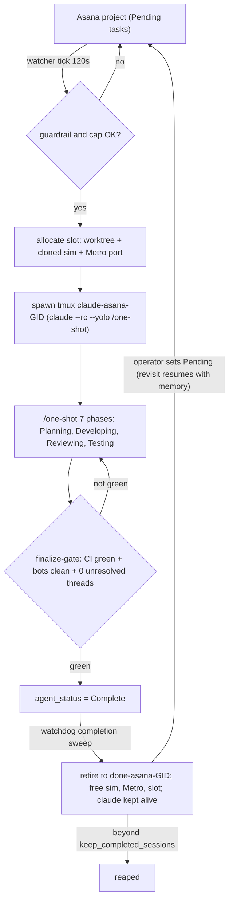
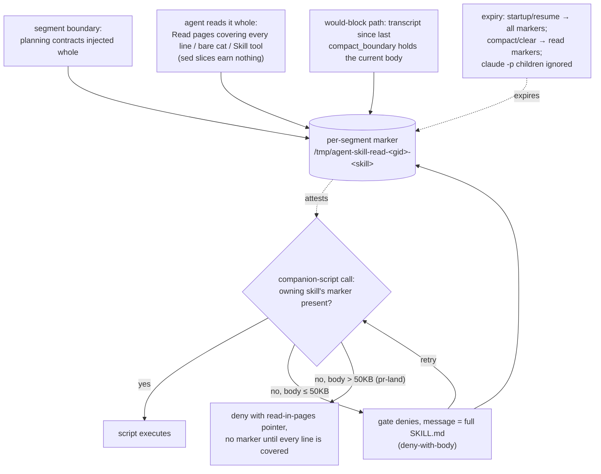

# edge-dev-agents

Complete agent-assisted development workflow for Edge repositories: slash
skills, companion scripts, coding standards, an autonomous Asana-to-PR
orchestration system with deterministic enforcement hooks, a post-hoc eval
suite, and meta-tooling for maintaining the workflow itself.

The distributable content lives under `.cursor/`. This repo is the versioned
home for those skills, rules, scripts, and docs, plus the portable
orchestration trees a second machine bootstraps from.

The `.cursor/` path is historical, not a commitment: the system is built to
sync across agent harnesses, not just Cursor. Claude Code is the primary
consumer today (`~/.claude/skills` symlinks to the canonical tree,
`~/.claude/CLAUDE.md` is generated from the always-apply rules, and the
enforcement hooks are Claude Code hooks); OpenCode gets generated mirrors via
`tool-sync.sh`. Other harnesses are untested, but the content is plain
markdown and shell, so most of it should carry in theory; the hook layer is
the Claude-specific part.

The canonical local doc lives at `~/.cursor/README.md`. During
`/convention-sync`, that file is mirrored to `edge-dev-agents/README.md`, and
the repo copy should not keep a second `.cursor/README.md`.

## Installation

**Fresh machine (one command):** clone this repo and run the bootstrap. It
installs everything (cursor skills/rules, the orchestration system, hook
registrations, and workflows) into your home dir, seeds `credentials.json`
from the example, and links skills:

```bash
git clone <this-repo> ~/git/edge-dev-agents && cd ~/git/edge-dev-agents && ./bootstrap.sh
# then edit ~/.config/agent-watcher/credentials.json with your real asana_token
```

For incremental onboarding instead of the full bootstrap:

**1. Set the required env var** in your `~/.zshrc`:

```bash
export GIT_BRANCH_PREFIX=yourname   # e.g. jon, paul, sam
```

This drives branch naming and PR discovery across the workflow.

**2. Sync the repo copy into `~/.cursor/`:**

This repo treats `~/.cursor/` as the canonical working copy. Use
`/convention-sync` to move local changes into `edge-dev-agents`, or run the
companion script directly when onboarding:

```bash
~/.cursor/skills/convention-sync/scripts/convention-sync.sh \
  --repo-to-user --stage
```

**3. Verify prerequisites:**

- `gh` CLI: `gh auth login`
- `jq`: `brew install jq`
- `ASANA_TOKEN` env var for Asana-backed workflows
- `claude` CLI (the orchestration spawns Claude Code sessions; the prose
  judge also shells out to it)

## Table of contents

- [Orchestration & memory](#orchestration--memory)
- [Enforcement hooks](#enforcement-hooks)
- [Prose standards & enforcement](#prose-standards--enforcement)
- [Testing infrastructure](#testing-infrastructure)
- [Evals](#evals)
- [Distribution (what syncs)](#distribution-what-syncs)
- [Architecture](#architecture)
- [Skills](#skills-slash-skills)
- [Companion scripts](#companion-scripts)
- [Rules](#rules-mdc-files)
- [Design principles](#design-principles)

## Orchestration & memory

The orchestration system runs Asana tasks to PRs autonomously: a watcher picks up
`Pending` tasks, spawns one isolated agent session per task, and a watchdog tends
the live sessions. Post-hoc evals grade what each run did.

### How a run flows

At a glance:


```mermaid
flowchart TD
  A["Asana project (Pending tasks)"] -->|"watcher tick 120s"| B{"guardrail and cap OK?"}
  B -- no --> A
  B -- yes --> C["allocate slot: worktree + cloned sim + Metro port"]
  C --> D["spawn tmux claude-asana-GID (claude --rc --yolo /one-shot)"]
  D --> E["/one-shot 7 phases: Planning, Developing, Reviewing, Testing"]
  E --> F{"finalize-gate: CI green + bots clean + 0 unresolved threads"}
  F -- "not green" --> E
  F -- green --> G["agent_status = Complete"]
  G -->|"watchdog completion sweep"| H["retire to done-asana-GID; free sim, Metro, slot; claude kept alive"]
  H -->|"operator sets Pending (revisit resumes with memory)"| A
  H -->|"beyond keep_completed_sessions"| I["reaped"]
```

#### 1. Watcher: spawn and resume

`agent-watcher/asana-watcher.js`, launchd every 120s, polls the project for
`agent_status = Pending`.

- **Tick gate.** The tick is skipped when a resource guardrail trips (1-minute
  load over `max_load_avg`, free RAM under `min_free_ram_gb`) or the
  concurrency cap is full (`max_concurrent`, default 4).
- **Provisioning.** Each pickable task gets a slot: a git worktree, a cloned
  simulator from the pool, and a Metro port. Before recloning the pool the
  watcher runs `refresh-master-build.sh`: if `develop` advanced AND its native
  side (`ios/Podfile.lock`) changed, the master sim is rebuilt from `develop`
  and the pool recloned, so runs test against a current build. A JS-only
  advance skips the rebuild (clones bundle JS live from Metro). The check is a
  cheap `git fetch` plus SHA compare; a build failure is non-fatal
  (provisioning continues on the last-good master). The failed develop SHA is
  memoized as `failed_sha` in `master-build.json` and not retried until develop
  moves; while develop HEAD equals it, a fresh edge-react-gui worktree branches
  from the last-good `develop_sha` instead (`setup-task-workspace.sh`), and
  `pr-land` refuses to land onto it (`develop-buildable.sh`, exit 3).
- **Fresh vs revisit.** A never-run task spawns fresh: `agent_status =
  Planning`, a tmux session `claude-asana-(gid)` running `/one-shot --yolo
  (task-url)`. A task with a prior transcript is RESUMED instead, on a fresh
  slot, via `resume-task`. Re-engaging a finished task is therefore one
  signal: set it back to `Pending`.
- **Resume memory, and why finalize is gated.** A resumed session's memory is
  never trusted for scope decisions: long runs auto-compact mid-flight, and
  the summary a compaction runs on predates whatever re-armed the task, so
  "the newest comment is my own Complete note" recalled from context is
  exactly the stale claim that has re-Completed past real followups. (Resumes
  themselves answer the resume menu with a FULL resume; the lossier
  summary-resume tier is retired, and a transcript past the degradation
  threshold fresh-spawns from artifacts instead.) The counter is mechanical:
  `check-followup-scope.sh` live-fetches comments and attachments, lists every
  operator comment newer than the latest `agent-run-report*.md` watermark,
  diffs the task's fields against the previous segment's snapshot, fetches
  GitHub-side scope across parent AND subtask-attached PRs (unresolved review
  threads, reviewer-bot completeness on owned ready HEADs, unanswered
  top-level review bodies and PR comments), and writes a marker; the
  `require-followup-scope-on-complete.sh` hook blocks `Complete` unless that
  marker exists, still matches the live newest comment, records zero blocking
  threads and bot gaps, and shows the report attachment as the newest
  agent-authored event (a 🥋-marked agent comment after the report means the
  watermark is stale and the report must be re-attached). Recalled context
  never stands in for the fetch.
- **Per-task model and effort.** Both spawn and resume route through
  `spawn-test-session.sh`, which pins the session model and reasoning effort
  from the task's `agent_model` / `agent_effort` Asana fields (models all
  1M-context; effort low through max). Unset falls back to config defaults
  (currently `.watcher.agent_model` = Opus 5 1M, `.watcher.agent_effort` =
  high).
- **Per-task self-review.** The task's `agent_review` field (`low`, `medium`,
  `high`, `xhigh`; unset follows `.watcher.default_review`, currently `none`)
  decides whether the run reviews its own branch before opening the PR, and at
  what depth. `asana-review-field.sh` resolves it to the arguments of the
  `code-review-sonnet` workflow, one level per field value. The phase runs
  after local verification and before PR creation: findings are judged against
  the diff, survivors are fixed as fixups folded into the commits they belong
  to, rejections are recorded with their evidence in the run report, and
  nothing is posted to GitHub.
- **Which Asana fields a run sees.** A task is homed on several boards, and a
  task read lists every board's fields. Runs read and write only the
  Engineering Board's fields (Priority, LOE, Repo, Category, Release, Build,
  Board State, Developer) and the jon-claude project's (`agent_*`, `tested`,
  `blocked`, `TDD?`). `asana-get-context.sh` prints only those, and
  `asana-task-update.sh` has no flag for any other board's field.
- **Version stamp.** Every spawn and resume segment records which orch version
  governs it: `stamp-orch-version.sh` appends content digests of the governing
  trees (skills, rules, watcher, hooks, settings hooks) plus repo head, CLI
  version, model, and effort to `versions/(gid).jsonl`, and exports
  `AGENT_ORCH_VERSION` for the run report. Evals slice findings by the version
  actually in force per segment.

#### 2. The run

`/one-shot --yolo`, a single agent turn: seven phases with `agent_status`
advanced via `update-status.sh` at each boundary. Planning (`/asana-plan`),
Developing (`/im`), Testing (`/build-and-test`, on-sim verification), Reviewing
(`/pr-create` through the CI + reviewer-bot watch), Complete. Status LEADS the
work: the phase status is set when that kind of work starts, never as a side
effect of a terminal action. The agent runs hands-off: no interactive prompts,
no self-respawn, every wait a bounded blocking in-turn call. The full decision
graph, including followup, concession, landing, and cheese branches, is in the
[/one-shot decision flowchart](#one-shot-decision-flowchart) below.

#### 3. Finalize: gate, land, or cheese

`Complete` requires the finalize gate: every primary PR CI-green, every
reviewer bot run-and-concluded clean on the ready HEAD, zero unresolved review
threads. At green, landability is decided FIRST: a PR with a human APPROVED
review (or the task's Force Land field) lands via `/pr-land` and the Build
field is ignored. Only a non-landable green run kicks a cheese build, pinning
the task's own unpublished dep PRs when the deliverable requires them.

#### 4. Watchdog

`agent-watcher/session-watchdog.js`, launchd every 120s, tends live sessions:

- RC-bridge revive (only when the bridge is dead)
- desktop archive (RC disconnect code 4090): kills anchor and chat sessions
  (transcript survives, `resume-agent --uuid <id> --chat --in-place` brings one
  back); run sessions stay alive with the revive suppressed
- completion sweep: `Complete` retires `claude-asana-(gid)` to
  `done-asana-(gid)`, frees sim/Metro/slot, keeps claude alive for
  re-engagement
- blocked = blocked COMPLETION (`Complete --blocked yes`): retires via the
  completion sweep; the shed-on-block branch is a legacy net for stray mid-run
  blocks
- GC: keep newest `keep_completed_sessions` / `keep_completed_worktrees`
  (currently 20 / 5)
- orphan-Metro reap, idle-dirty-sim reclaim, and operator escalation for
  parked prompts or stuck sessions

It does NOT re-engage finished tasks: that is the watcher's job (Pending
resumes), so watchdog and watcher stay decoupled.

#### 5. Sessions: tmux, remote control, and lifecycle

Every agent is an INTERACTIVE `claude --rc` process in a detached tmux
session, never a headless `claude -p`. The pane is part of the machinery, not
just a viewport.

- **Naming is state.** `claude-asana-<gid>` is a live run; the watchdog's
  completion sweep renames it to `done-asana-<gid>` at retirement (resources
  freed, claude kept alive); `chat-<slug>` sessions are discussion forks of
  past transcripts (`resume-agent.sh --chat`: talk to a finished run from
  anywhere, no slot, original conversation untouched); long-lived operator
  anchors keep their own names. Hooks and the watchdog read the name to decide
  context: the 🥋 authorship boundary is "pane name is exactly
  `claude-asana-<gid>`", so a retired session's text counts as operator
  instruction.
- **Spawn.** `spawn-test-session.sh` writes a wrapper script (slot env baked
  in: worktree cwd, `AGENT_SIM_UDID`, `AGENT_METRO_PORT`, task gid, model and
  effort flags) and launches it with `tmux new-session -d`. When claude exits
  the wrapper prints the exit time and drops to a shell, so the pane and its
  scrollback survive for diagnosis.
- **Resume poking.** `claude --resume` on a prior transcript shows an
  interactive menu that would wedge a hands-off session, so the spawner polls
  the pane and answers it with send-keys (Down+Enter: FULL resume; the
  summary tier is retired). This is the general pattern: the session is
  driven through its terminal exactly as an operator would drive it, which
  means every interactive surface the CLI grows is automatable without new
  APIs.
- **Remote-control keepalive.** Each session arms a remote-control bridge at
  startup, so the operator can steer any run from the desktop or phone app.
  Bridge liveness is read from the pane footer (the `/rc` token, or the
  "Remote Control active" line on older builds). The watchdog revives ONLY a
  verified-dead bridge on a verified-alive claude: kill the pane's process,
  confirm death, relaunch in place with `--remote-control <name> --resume
  <live-id>` and the preserved flags, under a per-session cooldown. A
  half-open bridge is left for the operator to reconnect, and the revive
  never adds a second process (the count goes 1 to 0 to 1).
- **No self-respawn.** A session never kills or relaunches its own pane;
  `resume-task.sh` and `resume-agent.sh` are watcher/operator tools and
  refuse to run from inside their target. The `no-self-respawn.sh` hook
  enforces the agent side.
- **Discussion sessions and briefs.** `spawn-chat-session.sh` starts a fresh
  session (a `chat-<slug>` discussion, or a named anchor with `--anchor`) and
  hands it a brief. The brief is copied to
  `~/.local/state/agent-watcher/briefs/<tmux-session>.<ext>` and the session
  receives only a short pointer to that copy, because a long prompt pasted
  into a just-started TUI loses its head. A brief is this machine's prompt to
  one session, so it never syncs: a brief saved inside a synced tree is
  refused before anything spawns.
- **Healing without the orch.** A box that hosts a pinned anchor but runs no Asana
  watcher (an operator laptop while the orch host is down) runs `rc-heal.sh`
  instead of `session-watchdog.js`: the watchdog's healing slice only, per
  anchor in `rc-heal.json` (recreate a dead tmux session, revive a dead claude,
  kill+respawn a dead RC bridge), one spawn per tick with verified-dead and
  cooldown guards; `tmux-keepalive.sh` is the KeepAlive LaunchAgent that keeps
  the tmux server alive across ticks, `install-rc-heal.sh` arms or disarms the
  pair, `rc-heal-test.sh` exercises the decisions. Not installed on the orch
  host; there the watchdog owns anchors. Both spawn paths mint the transcript id
  (`--session-id`) so the watchdog reads it from argv instead of guessing by
  newest jsonl.
- **Anchor hygiene.** Long-lived operator anchors (`watcher.persistent_anchors`)
  degrade as their conversation grows, so `reanchor-sweep.sh` (launchd, every
  30 min) resets one once it crosses 4 compactions or 25 MB AND has sat idle
  for 2 hours. It first has the anchor distill its open threads into its
  ledger (`anchor-<name>-open-threads.md` in auto-memory) and aborts unless
  that ledger was freshly written, then respawns the same tmux name with the
  same flags and points the fresh session at the ledger. The transcript is
  resolved from the process's own record (`~/.claude/sessions/<pid>.json`),
  and a resumed session is measured together with the transcript it resumed.
  `watcher.reanchor_exclude` lists anchors that stay persistent but are never
  swept (an anchor that holds standing instructions has nothing to distill).
  `touch /tmp/reanchor-hold` or `/tmp/reanchor-hold-<name>` vetoes a sweep.
- **The host must not idle-sleep.** All of this dies with the machine, so the
  box runs a keep-awake LaunchAgent (machine-local, not synced; an idle-sleep
  default once killed every bridge in the fleet after hours of quiet).

#### 6. Run reports and the watermark

Every run ends by attaching ONE structured run report to the Asana task
(`agent-run-report-NN-<slug>.md`). The report is more than documentation: its
attachment timestamp is the followup-scope WATERMARK. Comments newer than the
newest report are undischarged scope for the next run, so every comment a run
owes posts BEFORE the attach, and a comment that must land later forces a
re-attach so the watermark is last again. The attach boundary is gated (see
`require-clean-run-report.sh` below): template form, prose lint, traceability
frontmatter, one report doc per segment, and resolvable GitHub citations are
all checked mechanically.

#### 7. Eval

Post-hoc, per run or per cohort. See [Evals](#evals).

### /one-shot decision flowchart

The full decision flow of an orchestrated `/one-shot --yolo` run, including the
followup, concession, landing, and cheese branches. Rule ids in brackets name
the governing one-shot/cheese/build-and-test rules.


```mermaid
flowchart TD
  START["/one-shot --yolo task-url"] --> REFIRE{"re-fire? task already
  ran in this session"}
  REFIRE -- "no (fresh or resumed-new)" --> PLAN
  REFIRE -- "yes, still mid-run" --> CONT["continue current phase
  [ignore-refired-one-shot]"]
  REFIRE -- "yes, previously FINISHED" --> SCOPE["LIVE scope check:
  check-followup-scope.sh
  (never from memory)"]
  SCOPE -- "operator asks newer
  than report watermark" --> FOLLOWUP["deliver the new scope
  [followup-scope-is-the-deliverable]"]
  FOLLOWUP --> DEV
  SCOPE -- "0 newer comments" --> GATE

  PLAN["Planning: /asana-plan, plan doc
  (confirmation waived in yolo)"] --> DEV
  DEV["Developing: /im contract
  (lint-warnings, lint-commit,
  clean history)"] --> TEST
  TEST["Testing: slot-preflight -> obey PLAN/INVOKE
  -> build -> drive the REAL action on sim
  (log-attempt every drive, pixel-verify proofs)
  [preflight-before-build-decisions]"] --> WALL{"hit a wall?"}
  WALL -- no --> PR
  WALL -- yes --> ATTEMPT["log the attempt
  (failed:/blocked:/loss:)"] --> VALID{"concession-validator
  verdict [yolo-true-blockers]"}
  VALID -- "legitimate: true" --> BLOCKED["blocked completion:
  Complete --blocked yes (one-line
  comment, report attached as normal)"]
  VALID -- "legitimate: false" --> RETRY["do what_to_try, continue"] --> TEST

  PR["Reviewing: /pr-create (verify green, clean tree,
  template, evidence; Asana attach; multi-repo
  subtasks; draft dep PRs excluded from gate)"] --> WATCH
  WATCH["watch-pr bounded poll; bots must be
  SUCCESS (NEUTRAL = findings -> /bugbot);
  fixes via amend + force-with-lease"] --> GATE
  GATE{"finalize-gate green:
  CI + every bot clean +
  0 unresolved bot threads
  on EVERY primary PR"}
  GATE -- "not green" --> WATCH
  GATE -- green --> LAND{"landable? human APPROVED
  review (any point in history)
  OR Force Land field
  [land-on-approval]"}

  LAND -- yes --> PRLAND["/pr-land with TASK URL
  (dep ordering: merge dep -> publish ->
  bump -> gui; npm OTP parks at
  operator boundary). Build field IGNORED
  -> NO cheese push"] --> REPORT
  LAND -- no --> BUILDF{"Build field?
  [cheese-build-on-green]"}
  BUILDF -- none --> REPORT
  BUILDF -- staging --> REPORT
  BUILDF -- "cheese (feta/gouda/...)" --> PINQ{"gui deliverable requires
  unpublished dep PRs?"}
  PINQ -- yes --> PINNED["/cheese --pin each dep
  at ITS PR head
  [cheese:orch-pins-required]"] --> REPORT
  PINQ -- no --> POINTER["/cheese pointer reset
  test-branch -> PR head"] --> REPORT

  REPORT["RE-READ report template -> write report
  -> require-clean-run-report lint at attach
  -> set tested field from THIS run's evidence"] --> COMPLETE
  COMPLETE["agent_status = Complete
  (gated: fresh followup-scope check
  required by hook)"]
```

Status discipline throughout: the phase status is set when that KIND of work
starts (status leads the work), never as a side effect of a terminal action.

## Enforcement hooks

The hands-off contract and the quality bars are enforced by deterministic
Claude Code hooks, not merely documented. Registrations live in
`~/.claude/settings.json` and are distributed as the `claude-settings/hooks.json`
projection (see [Distribution](#distribution-what-syncs)); the scripts live in
`agent-watcher/hooks/`. Hook BODIES are re-read from disk on every fire, so a
script fix reaches every live session immediately; only registration changes
need a session restart or settings reload.

Most gates no-op unless `AGENT_TASK_GID` is set (orchestrated sessions only).
The prose gates and the Asana authorship marker run everywhere, because
interactive sessions post PRs and Slack messages too.

### Skill-contract delivery (deny-with-body)

The dominant compliance failure across audited runs is cross-file-read
skipping: rules INSIDE the prompt a session holds are followed almost
universally, while obligations that require reading ANOTHER skill file
mid-flow get skipped or satisfied with a partial slice. The enforcement
stack therefore never trusts "go read X". A contract reaches a run's context
in one of these ways, all of which stamp the same per-segment marker, and
the marker is what the read-gate checks before letting any companion script
execute:

1. **Injected at the boundary** — every fresh segment gets the planning
   contracts (asana-plan + task-review) pushed in whole by
   `inject-run-context.sh`.
2. **Read whole by the agent**: strict marking, every check made against the
   current file on disk. Reads of the SKILL.md whose returned lines together
   cover every line (one uncapped Read, or pages when the token cap cuts a
   Read short), a `cat` whose unaltered stdout holds the body (no pipe,
   redirect, capture, or persisted output), or a Skill-tool invocation. A
   `sed` slice or `cat | head` earns nothing, because partial credit would
   suppress delivery.
3. **Delivered by the gate itself** — a script call with no marker is DENIED,
   and the deny message IS the full SKILL.md body (marker written at
   delivery). The uneducated call never executes; the retry arrives with the
   complete contract. This is one round-trip cheaper than the old
   block→read→retry loop.
4. **Proven from the transcript**: before denying, the gate scans the
   session transcript from the last compaction boundary for the complete
   current body (a `/skill` slash-command delivery, compaction's
   `invoked_skills` re-injection when not cut at 20k chars, a `file`
   attachment, or covering Read pages) and credits it. A skill edited since
   delivery never matches; any scan failure credits nothing
   (`lib/skill-read-evidence.js`).

Markers are evidence about what is IN CONTEXT, so they expire when the
context does: startup/resume (a new segment) kills all of them plus the
ingestion marker; compact/clear kills the read markers, because compaction
keeps a paraphrase and drops the rules; headless `claude -p` children
(the no-slop judge) inherit the gid but are ignored entirely. Re-arming is
cheap by design — the gate re-delivers lazily, only for skills the run
actually touches again.


```mermaid
flowchart TB
    SPAWN["segment boundary:<br/>planning contracts injected whole"]
    READ["agent reads it whole:<br/>Read pages covering every line / bare cat / Skill tool<br/>(sed slices earn nothing)"]
    SCAN["would-block path: transcript since last<br/>compact_boundary holds the current body"]
    GATE["gate denies, message = full SKILL.md<br/>(deny-with-body)"]
    M[("per-segment marker<br/>/tmp/agent-skill-read-&lt;gid&gt;-&lt;skill&gt;")]
    CALL{"companion-script call:<br/>owning skill's marker present?"}
    RUN["script executes"]
    PTR["deny with read-in-pages pointer,<br/>no marker until every line is covered"]
    EXP["expiry: startup/resume → all markers;<br/>compact/clear → read markers;<br/>claude -p children ignored"]
    SPAWN --> M
    READ --> M
    GATE --> M
    SCAN --> M
    M -.attests.-> CALL
    CALL -->|yes| RUN
    CALL -->|"no, body ≤ 50KB"| GATE
    GATE -->|retry| CALL
    CALL -->|"no, body > 50KB (pr-land)"| PTR
    EXP -.expires.-> M
```

The gate closes one half of the substitution failure class (a sanctioned
script run contract-blind); the raw-API blocks (`block-raw-asana-api.sh`,
`block-raw-gh-writes.sh`, `block-raw-thread-resolve.sh`) close the other
half (an improvised replacement for the script), and the status gates
check outcome evidence at phase boundaries regardless of how the work was
done.

| Group | Hook | Enforces |
|---|---|---|
| Status gates | `require-plan-before-developing.sh` | No Developing until ingestion evidence (`asana-get-context.sh` ran, attachments downloaded) AND the plan doc exist |
| | `require-completion-judgment.sh` | Every completion event (Complete, PR creation, `blocked = Yes`) is ruled on by a headless judge OUTSIDE the run, from an evidence bundle; the verdict is bound to the evidence hash, so an unchanged retry is instant and new evidence is re-judged. A block needs `--reason`. The run never writes a verdict or a waiver. `require-concession-validation.sh` remains as a 6-line shim that forwards here |
| | `require-followup-scope-on-complete.sh` | Complete needs a fresh live scope check: no newer operator comments unaddressed, zero blocking threads, reviewer bots concluded, watermark last; refreshes the check itself when only the run's own comments postdate it |
| | `require-continuation-or-block.sh` (Stop) | A turn may not end except at Complete or a validated block |
| | `require-tdd-current.sh` | TDD-flagged tasks keep the design doc current before finalize |
| PR / git gates | `git-history-gate.sh` | Commits go through `lint-commit.sh`; no raw `git commit`, no `--no-verify` |
| | `pre-pr-gate.sh` | PR creation needs test evidence (proof frames or a justified blocker note) and runs a duplicate-utility scan |
| | `require-subtasks-for-multi-repo-pr.sh` | Multi-repo PR sets attach subtask-per-PR, never flat onto the main task |
| | `require-clean-run-report.sh` | Report attach: template form, prose lint (with judge), traceability frontmatter auto-fill, stable ordinals, one doc per segment, no dead GitHub citations |
| | `block-raw-thread-resolve.sh` | Review threads resolve through the reply-first scripts, never raw GraphQL |
| | `block-raw-gh-writes.sh` | Raw `gh pr create` (non-draft), `gh pr comment`/`review`, and `gh api` comment/review writes go through the linted companion scripts |
| | `block-upfront-conflict-probe.sh` | PR mergeability is a landing-time concern; no upfront probes |
| | `ensure-tdd-pr-link.sh` | PR bodies carry the TDD link when one is owed |
| | `no-push-after-complete.sh` | No branch/PR mutation once the task is Complete (post-Complete rework must re-arm) |
| Sim / testing gates | `require-playbook-before-drive.sh` | The sim-testing playbook must be read before the first drive; injects the corePlugins working-set contract once per run |
| | `require-maestro-device.sh` | Drives name an explicit `--device` (concurrent sims make defaults ambiguous) |
| | `block-simctl-booted.sh` | No `simctl ... booted` in slot sessions |
| | `block-coordinate-taps.sh` | No blind coordinate taps; drive by accessibility ids or text |
| | `block-sim-wipe.sh` | No sim erase/wipe (pooled sims carry funded test accounts) |
| | `require-bundle-triage.sh` | Stale-bundle symptoms get triaged before deeper debugging |
| Prose gates | `lint-md-on-write.sh` | Mechanical no-slop lint on markdown written outside the internal allowlist (full on Write, fragment on Edit/heredoc) |
| | `slack-prose-gate.sh` | Outbound Slack text passes the shared lint with the judge tier; brevity nudge over ~900 chars |
| Hygiene / injectors | `no-interactive-prompt.sh` | No AskUserQuestion in hands-off runs; pick the defensible default |
| | `no-self-respawn.sh` | No ScheduleWakeup/CronCreate/`claude --resume` self-respawn |
| | `guard-piped-watcher-scripts.sh` | Watcher status scripts run bare (pipes silently masked their exit codes); gated-claim commands hard-block instead of rewriting |
| | `mark-agent-authored-asana.sh` | In-flight-run Asana prose carries the 🥋/👊 authorship markers; operator-context text stays unmarked |
| | `record-own-asana-story.sh` (PostToolUse) | Records the story gid of each in-flight run's own MCP comment so the Complete gate can tell it from operator scope (`asana-task-update.sh --comment-file` records the script path) |
| | `require-skill-for-file.sh` | A file with an owning skill is written only after that skill entered context, on every vector (Write, Edit, redirect, tee, sed -i, interpreter heredoc); deny-with-body via the shared gate library, one glob table for all of them. AGENTS.md: agents-md, every session. CHANGELOG.md: changelog, orch runs. The workflow itself (`SKILL.md`, `.mdc` rules, skill and agent-watcher scripts, site-orch's hooks, and `~/.claude/settings.json`, where a wrong registration means a hook never fires): author, every session |
| | `lint-md-on-write.sh` | Markdown written outside the internal allowlist passes the mechanical no-slop tier on every vector (Write, Edit, redirect, tee, sed -i, perl -pi); CHANGELOG.md targets also pass the changelog entry-shape lint (length cap, mechanism tails, second sentences) |
| | `require-skill-read-for-scripts.sh` + `mark-skill-read.sh` | A skill's companion script runs only after its SKILL.md FULLY entered context; the deny message delivers the complete body itself (deny-with-body) and writes the marker, so the retry passes educated, and states that the whole Bash command was cancelled. Marking is strict and content-checked against the current file: Read pages covering every line (a token-capped Read counts only the lines it returned), a `cat` whose unaltered stdout holds the body, Skill tool, or gate/session-start injection; partial reads (sed slices, cat piped to head or redirected) earn nothing. Before denying, the gate credits a body the transcript proves is in context since the last compaction (slash-command delivery, uncut `invoked_skills` re-injection, covering Read pages). `--help`/`-h`-only invocations are exempt. Bodies over 50KB (pr-land) fall back to a read-in-pages pointer without a marker. The same gate also delivers a /one-shot PHASE SLICE (`one-shot:<phase>`, `references/<phase>.md`) at the first companion-script call of that phase, since the split left only the core in context by default |
| | `mark-playbook-read.sh` | Records the playbook read the drive gate requires |
| | `record-file-writes.sh` (PreToolUse Bash + PostToolUse) | Records which session wrote which file, as the write happens, into `~/.local/state/agent-watcher/write-ledger.jsonl`: Write/Edit by `file_path`, Bash by what changed under the synced trees since a pre-call stamp (so `sed -i`, redirects and interpreter heredocs are seen). A file the command names is a strong row; one that only changed during the call is a weak row, since a long command overlaps every other session's writes. A subagent's write lands on its parent session. `/convention-sync` reads it to learn whose diffs it has not seen. Machine-local state, every session, never blocks |
| | `nudge-asana-mcp.sh` | Steers bulk Asana reads to the cheaper script path |
| | `block-raw-asana-api.sh` | Raw Asana API calls go through the sanctioned scripts (ingestion with attachment download, field reads, writes, scope checks) |
| | `inject-run-context.sh`, `inject-no-slop-reminder.sh`, `inject-no-slop-line.sh` | Session-start run context, plus the asana-plan + task-review bodies on every fresh segment (startup/resume, and compact while unplanned); a fresh segment (startup/resume) expires the prior segment's ingestion + skill-read markers, and compact/clear expire skill-read markers too, since compaction destroys the in-context text the marker attests to (the read-gate then re-delivers bodies lazily); headless `claude -p` children (no-slop judge etc.) inherit the gid but are ignored, since a child's startup is not a run segment; no-slop refresh at session start and every prompt |
| Shared helpers | `strip-cmd-mentions.sh` | Blanks quoted/heredoc spans so hooks trigger on commands, not on text that merely mentions them |
| | `cmd-executes.sh` | Command-position matching, so naming a script in a grep never fires the gate that guards executing it |

`retired/require-block-validation.sh` is an unregistered legacy kept for history; the
completion judge's `block` event replaced it.

## Prose standards & enforcement

All outward prose (PR bodies and comments, commit messages, Asana text, run
reports, Slack, docs that leave the team, and chat replies) follows the
[/no-slop](.cursor/skills/no-slop/SKILL.md) rules: banned vocabulary, no
em dashes, no courtesy enders, no structure announcements, no count-announcement
openers, plain copulas. The full pattern list is published with this repo, so
review comments can cite it instead of private config paths.

Enforcement is layered, one shared implementation per rule class
(`no-slop/scripts/no-slop-lint.sh` is the single lint every boundary calls):

- **Mechanical tier** (regex-decidable): em dashes, banned vocabulary, Claude
  session links, decorative loudness, count-announcement shapes including
  trailing count-appositions. Exit 1 on HARD findings.
- **Semantic tier** (`--semantic`): a haiku judge (`no-slop-judge.sh`) for the
  rules regexes cannot decide: courtesy enders, forward references, validation
  preambles. A wide regex net nominates candidate sentences, one batched
  `claude -p` call rules on them, verdicts cache by sentence hash, and every
  infra failure fails open. Calibrated on violation and look-alike corpora
  before being made blocking.
- **Fragment mode** (`--fragment`): position-independent checks only, for Edit
  fragments and heredoc command text where sentence-shape checks would
  false-positive.

Where each tier runs:

| Boundary | Tier | Enforced by |
|---|---|---|
| Markdown file writes (outside internal allowlist) | mechanical | `lint-md-on-write.sh` hook |
| PR body at create | mechanical + judge | `pr-create.sh` |
| PR replies, mark-addressed, standalone comments | mechanical + judge | `pr-address.sh` |
| Review submits (top-level + inline bodies) | mechanical + judge | `github-pr-review.sh` |
| Slack sends, drafts, canvases | mechanical + judge | `slack-prose-gate.sh` hook |
| Run-report attach | mechanical + judge (em dashes auto-rewritten in place) | `require-clean-run-report.sh` hook |
| TDD docs | mechanical | `tdd-lint.sh` |
| Commit messages | scrub (session trailers/URLs stripped) | `lint-commit.sh` |

The file-write hook exists because posted prose travels as
`--body-file`/`$(cat file)` per the file-over-args convention, so a
command-string hook literally cannot see it; the bytes are visible when the
file is written and when the poster script assembles the final body, and both
points are covered. Known residuals: raw `gh api` posting that bypasses the
scripts is unlinted, and Asana comments get the authorship marker but no prose
lint today.

## Testing infrastructure

`/build-and-test` owns verification. For edge-react-gui and its dependency
repos, verification means driving the REAL user action on a booted simulator
(maestro), not just green unit tests: a dep change is not done until it runs in
the app.

- **Sim slots.** Each orchestrated run gets a cloned simulator from a pool,
  its own Metro port, and a worktree. Pool management, cloning, and
  restoration live in `agent-watcher/` (`ensure-sim-pool.sh`,
  `clone-ios-sim.sh`, `restore-sim-app-container.sh`).
- **The sim-testing playbook**
  (`build-and-test/references/sim-testing-playbook.md`) carries the working
  knowledge runs need: how to use the funded test-account roster (the roster
  itself is local-only, `~/.config/edge-secrets/test-accounts.json`), per-provider drive
  recipes, known gotchas with their continue-workarounds, the corePlugins
  working-set trim (filter to the assets the task needs, with a funding
  carve-out: filtering is a convenience, never a constraint), and the fallback
  gates. The drive gate blocks the first maestro drive until it is read.
- **Flow library** (`build-and-test/maestro/common/`): parameterized,
  reusable maestro flows (login, wallet find, send-to-address, swap pair
  selection, ramp region/fiat, throwaway-account lifecycle, slider confirm).
  Task-specific flows an agent writes mid-run stay local and are excluded from
  sync; recurring sequences get promoted into the library through eval
  curation.
- **Attempt log.** Every value-moving action and drive logs through
  `log-attempt.sh` with a truthful result; the log is the ground truth evals
  and the concession gate read. Proof screenshots are pixel-verified, and
  hack-forced frames must carry the 🪓 marker.
- **Cheese builds** (`/cheese`): push a `test-*` branch so testers get a build
  of the PR head; the orchestration pins unpublished dep PRs when the
  deliverable needs them. The task's Build field routes this at finalize.
- **Tested field.** Each run sets the task's `tested` multi-select (iOS Sim,
  Android Sim, Android Device, Unit Tests, Untested) from that run's own
  evidence via `set-tested.sh`.

## Evals

The eval suite grades finished runs against explicit rubrics, with every BAD
finding carrying a citation an auditor can open.

- **`/resolve-run`** builds the evidence manifest per run: transcript path,
  PRs, Asana state, attempt log, friction block (hook blocks, tool errors,
  compactions), version stamps, release receipt.
- **`/agent-eval`** grades process compliance and outcome honesty against the
  agent-behavior rubric (dimensions A1-A36: status hygiene, completion
  honesty, report discipline, testing depth, tested-field accuracy, deferral
  validity, self-review discipline, and more). A profile run reads only its rows
  (`scripts/rubric-slice.sh <profile>`); dated expectations live in one era
  table (`references/era.md`, split per run by `scripts/era.sh` into the
  manifest's `era` block) instead of inside the rows; `references/tiers.md`
  says who pays when a finding is real (trust, lost scope, budget, hygiene).
- **`/orch-eval`** grades infrastructure health (fork storms, memory
  pressure, liveness, resource accounting, gate coverage) against the O-dims.
- **`/eval-run`** orchestrates cohorts through a background multi-agent
  workflow. Two eval types, never conflated: the default REPORT-EVAL grades
  what a run claimed (report vs live GitHub/Asana APIs; transcripts never
  opened; ceiling REPORT_CLEAN), and the heavier TRANSCRIPT-EVAL (the only
  path to GOLD) runs the full process pass plus orch-eval on named or
  escalated runs. Every BAD is adversarially re-verified before it lands in a
  report. Cohort reports open with a "Needs you" checklist grouped by tier
  (re-runs, field corrections, infra fixes, rulings, then playbook and flow
  promotions) that the operator approves row by row; nothing executes
  unapproved. Recurring remediation classes live in an actions ledger
  (`scripts/actions-ledger.sh`, `~/agent-evals/actions-ledger.json`) so
  recurrence across cohorts and "approved but unbuilt" are counted by script,
  and a class that recurs after its fix shipped shows as regressed.
- **Coverage ledger** (`eval-coverage.sh`): which runs have been evaluated
  under which lens, and which are STALE (new segments since their last eval)
  or NEVER-evaluated. Default cohort scope comes from this queue, not date
  guessing.
- **Rubric drift** (`rubric-drift.sh`): every rubric row anchors to the rule
  and script content it grades against, by content digest. A changed anchor
  means dimensions may grade against stale expectations; CHANGED/UNCOVERED
  findings block until reconciled (`--forget` drops an anchor the rubric
  stopped citing on purpose). The era table keeps old runs graded by the
  rules in force when they ran; rubric rows themselves carry no dates.
- **Friction scorecard** (`friction-scorecard.sh`): a zero-LLM trend table
  between cohorts (hook blocks, tool errors, builds, compactions, drives,
  attempt walls) straight from manifests.

## Distribution (what syncs)

Beyond cursor skills/rules, this repo mirrors portable trees so a second Mac is
reproducible from a single clone + `./bootstrap.sh`:

- **`agent-watcher/`**: the autonomous orchestration system (Asana watcher
  daemon, session watchdog, worktree/iOS-sim pool helpers, the enforcement
  hooks, status/attempt/tested scripts). Canonical home is
  `~/.config/agent-watcher`. Committed: scripts, `*.js`, `asana-config.json`,
  docs, and `credentials.example.json`. **Never committed:** `credentials.json`
  (secret) and machine-local state (`pool.json`, `slots.json`,
  `watchdog-state.json`, `*.state`, `*.log`, forensics) and session briefs
  (`*-anchor-brief.*`; briefs live in `~/.local/state/agent-watcher/briefs`).
- **`agent-watcher/launchd/`**: templates for every `com.jontz.*` launchd job
  (watcher, watchdog, reanchor sweep, checkout refresh, guards) plus
  `install-launchd.sh`, which renders `__HOME__` and `__NODE_BIN__`, writes
  `~/Library/LaunchAgents`, and loads each job, skipping any whose program is
  not on the machine. The templates are the source of truth; the installed
  plists are generated. Scripts that run under launchd source
  `lib/launchd-env.sh` for their PATH, so a job definition never has to carry
  tool paths.
- **`claude-settings/hooks.json`**: a PROJECTION of the `.hooks` key of
  `~/.claude/settings.json`. Hook scripts ship in the agent-watcher tree;
  without this projection they would be installed but never fire.
  User-to-repo sync exports the key; repo-to-user and `bootstrap.sh` merge it
  back replacing ONLY `.hooks`, so model/theme and other machine-local
  settings stay put, and an unconfigured machine can never blank the canonical
  registrations.
- **`claude-workflows/`**: multi-agent Workflow scripts installed to
  `~/.claude/workflows` (currently `code-review-sonnet.js`, the deep
  multi-agent PR review harness `/pr-review` launches).
- **`bin/link-shared-memory.sh`**: symlinks the cross-cutting Claude memory
  notes in `~/.claude/memory-shared` into each per-project auto-memory dir and
  maintains a managed block in each `MEMORY.md`. The notes themselves are
  NEVER published here: they travel only in the machine-migration bundle.
  Claude auto-memory is machine-local and also NOT synced. The only officially global Claude file is `~/.claude/CLAUDE.md`,
  generated here from always-apply rules.
- **`.cursor/.syncignore`**: permanent sync exclusions, read from the REPO
  copy so every machine honors the same list. Currently: WIP commands and
  task-specific maestro flows (dev artifacts, not conventions). Third-party
  skills need no entry: the sync ships only skills this repo already tracks or
  whose frontmatter names an author it distributes, and reports every other
  entry under `excludedSkills` with its reason.

The session that runs `/convention-sync` owns the whole commit. A sync
routinely carries files other sessions wrote, so it reads every diff, asks a
live author when a diff does not explain itself (the write ledger says whose
it is), and then describes all of it by subject, as one body of work, in the
commit and the Slack announcement. This README and the hook registry
(`agent-watcher/hooks/README.md`) are brought current in the same commit;
`readme-gaps.sh` lists added files no README names and deleted files one still
names, and blocks the commit until they are dealt with.

`/convention-sync` keeps all of the above in sync (home to repo) and hard-blocks
staging when the remote is ahead, the branch is wrong, or the sync would delete
or revert canonical files authored elsewhere (the fix is a repo-to-user pass
first). `bootstrap.sh` does the reverse (repo to home) on a new machine.

### Why sync scripts instead of a plain git checkout of home

The repo's remote side is plain git (normal pull/push on the checkout). The
sync machinery exists for the other hop, home to checkout, and the honest
rationale splits into structural reasons and historical ones:

- **The canonical "tree" is not one tree, and not all files** (structural).
  It spans `~/.cursor`, `~/.config/agent-watcher`, `~/.claude/workflows`,
  and the `.hooks` KEY inside `~/.claude/settings.json`, whose sibling keys
  (model, theme) are machine-local. Git versions whole files; the settings
  projection needs a key-level merge step under any design, and no checkout
  layout absorbs it.
- **Both machines operate unattended** (structural). The home tree has
  concurrent uncoordinated writers: anchor sessions editing skills, agent runs
  appending to skill references mid-task, eval tooling rewriting `rubric-drift.lock.json`.
  A checkout of home would be perpetually dirty, and a pull that conflicts
  needs a human at the keyboard that these boxes do not have. The sync's
  content-hash staleness blocks and mtime `skippedNewer` protection are
  cruder than git merge but never require interactive resolution; the
  prescribed recovery (repo-to-user pass, then re-push) is a command, not a
  conflict editor.
- **Secrets are NOT a real justification.** `credentials.json` and state files
  are kept out by hardcoded rsync excludes, but a `.gitignore` would do the
  same job in a checkout model. The excludes are a gitignore in different
  clothing.
- **The deletion guards compensate for rsync, not for git.** Mirror-style sync
  from a stale machine would delete files it never had; git pull/push ordering
  prevents that class natively. Those guards are a cost of this design, not a
  benefit over the alternative.
- **Path dependence** (historical). `~/.cursor` grew as a live config dir
  first; the repo came later as a distribution copy, and nothing has forced
  the relocation cost since: a checkout-plus-symlinks redesign means touching
  every launchd plist, hook registration, and absolute path in scripts, and
  it still keeps a merge step for the settings projection.

Net: the settings-key projection and unattended conflict handling are why the
scripts stay; the file-copying part is the replaceable bit if the relocation
cost is ever paid.

## Architecture

```text
edge-dev-agents/
├── README.md          # Synced copy of ~/.cursor/README.md
├── bootstrap.sh       # Fresh-machine installer (repo -> home)
├── agent-watcher/     # Orchestration system incl. hooks/, launchd/ (-> ~/.config/agent-watcher)
├── claude-settings/   # hooks.json registration projection (-> ~/.claude/settings.json .hooks)
├── claude-workflows/  # Workflow scripts (-> ~/.claude/workflows)
├── bin/               # link-shared-memory.sh
└── .cursor/
    ├── skills/        # Slash skills (*/SKILL.md) + companion scripts
    ├── scripts/       # Shared portability and dashboard scripts
    ├── commands/      # Minimal command wrappers
    └── rules/         # Coding and workflow standards (.mdc)
```

**Separation of concerns:**

- **Skills** (`SKILL.md`) define workflows, rules, and step ordering.
- **Companion scripts** (`.sh`, `.js`) handle deterministic work like git,
  GitHub, Asana, and JSON processing.
- **Hooks** enforce the contracts deterministically at tool-call time.
- **Rules** (`.mdc`) provide persistent guidance that gets loaded by context.
- **Repo docs** describe the system and how the distribution copy fits
  together.

All GitHub API work uses `gh` CLI. Deterministic git operations should live in
scripts, not be re-described independently across skills.

## Skills (slash skills)

### The orchestrated pipeline

| Skill | Description |
|------|-------------|
| [`/one-shot`](.cursor/skills/one-shot/SKILL.md) | End-to-end task flow: plan, implement, test, PR, finalize; the skill orchestrated runs execute |
| [`/asana-plan`](.cursor/skills/asana-plan/SKILL.md) | Build an implementation plan from Asana or ad-hoc requirements |
| [`/task-review`](.cursor/skills/task-review/SKILL.md) | Fetch Asana task context, summarize, and resolve the target repo by code evidence |
| [`/im`](.cursor/skills/im/SKILL.md) | Implement with clean, structured commits (lint-warnings, lint-commit, history discipline) |
| [`/build-and-test`](.cursor/skills/build-and-test/SKILL.md) | Build and verify: real on-sim maestro drives for GUI work, playbook + flow library |
| [`/pr-create`](.cursor/skills/pr-create/SKILL.md) | Create a PR with repo-aligned title/body, evidence, and Asana attach |
| [`/bugbot`](.cursor/skills/bugbot/SKILL.md) | Address Cursor Bugbot findings until the PR is actually clean |
| [`/pr-address`](.cursor/skills/pr-address/SKILL.md) | Address PR feedback: fixups, reply-then-resolve, mark-addressed |
| [`/pr-review`](.cursor/skills/pr-review/SKILL.md) | Review a PR: deep multi-agent pass by default, Edge-specific checklist |
| [`/pr-land`](.cursor/skills/pr-land/SKILL.md) | Land approved PRs: prepare, merge, publish, GUI dep bumps, staging cherry-picks, Asana updates |
| [`/develop-staging`](.cursor/skills/develop-staging/SKILL.md) | Cut a staging release: bump the version, merge develop into staging, gate on develop/staging parity |
| [`/staging-cherry-pick`](.cursor/skills/staging-cherry-pick/SKILL.md) | Cherry-pick landed staging-targeted commits onto staging |
| [`/cheese`](.cursor/skills/cheese/SKILL.md) | Push a test-branch build, pinning unpublished dep PRs when required |
| [`/changelog`](.cursor/skills/changelog/SKILL.md) | Update CHANGELOG entries using repo conventions |
| [`/dep-pr`](.cursor/skills/dep-pr/SKILL.md) | Create dependent Asana tasks and downstream PR work in another repo; the dep task joins the parent's projects, inherits its Engineering Priority and Release, and blocks it |
| [`/tdd`](.cursor/skills/tdd/SKILL.md) | Write or update a technical design document for shipped work |

### Guards and validators

| Skill | Description |
|------|-------------|
| [`/concession-validator`](.cursor/skills/concession-validator/SKILL.md) | Judge whether delivering less than the prescribed bar is legitimate; deny-on-sight taxonomy |
| [`/blocker-validator`](.cursor/skills/blocker-validator/SKILL.md) | Judge whether a proposed block is a true blocker or a premature yield |
| [`/no-slop`](.cursor/skills/no-slop/SKILL.md) | The prose rules; its scripts are the shared lint + judge every boundary calls |

### Evals

| Skill | Description |
|------|-------------|
| [`/eval-run`](.cursor/skills/eval-run/SKILL.md) | Orchestrate cohort evals (report-eval default, transcript-eval on escalation) with an operator Actions checklist |
| [`/agent-eval`](.cursor/skills/agent-eval/SKILL.md) | Grade one run's process compliance and outcome honesty against the rubric |
| [`/orch-eval`](.cursor/skills/orch-eval/SKILL.md) | Grade one run's infrastructure health |
| [`/resolve-run`](.cursor/skills/resolve-run/SKILL.md) | Build the per-run evidence manifest evals consume |
| [`/chat-audit`](.cursor/skills/chat-audit/SKILL.md) | Audit chat sessions for waste, drift, and workflow gaps |

### Asana and utility

| Skill | Description |
|------|-------------|
| [`/asana-task-update`](.cursor/skills/asana-task-update/SKILL.md) | Generic Asana mutations: attach PR or file, comment (post, edit or delete our own), assign, Board State, Engineering Priority / Release / Developer, description tail |
| [`/asana-task-create`](.cursor/skills/asana-task-create/SKILL.md) | Create Edge dev tasks on the standard boards with the right fields |
| [`/kanban-categorize`](.cursor/skills/kanban-categorize/SKILL.md) | Sweep a kanban board and populate Category fields |
| [`/convention-sync`](.cursor/skills/convention-sync/SKILL.md) | Sync `~/.cursor/` + portable trees with this repo; mirror this README; update the PR description |
| [`/author`](.cursor/skills/author/SKILL.md) | Create, revise, and debug skills, scripts, and rules |
| [`/agents-md`](.cursor/skills/agents-md/SKILL.md) | Write or revise a repo's AGENTS.md agent-context file |
| [`/q`](.cursor/skills/q/SKILL.md) | Answer questions before taking action |
| [`/local-research`](.cursor/skills/local-research/SKILL.md) | Multi-agent research over the local filesystem with citation-backed reports |
| [`/resume-session`](.cursor/skills/resume-session/SKILL.md) | Find and resume the right past claude session |
| [`/debugger`](.cursor/skills/debugger/SKILL.md) | Inspect runtime state in a running React Native app |
| [`/fix-eslint`](.cursor/skills/fix-eslint/SKILL.md) | Apply documented fixes for recurring ESLint warnings |
| [`/coinhub`](.cursor/skills/coinhub/SKILL.md) | Maintain the Coinhub white-label build |
| [`/obsidian`](.cursor/skills/obsidian/SKILL.md) | Manage notes in the local Obsidian vault |
| [`/drunk-claude`](.cursor/skills/drunk-claude/SKILL.md) | Novelty persona skill |

Third-party skills (the `banana` image generator, and whatever Claude Code
syncs into `skills/synced/<bucket>/`) stay local: the sync ships only skills
this repo already tracks or whose frontmatter names an author it distributes,
and lists everything it skipped under `excludedSkills`.

## Companion scripts

Scripts live beside the skill that owns them (`<skill>/scripts/`); shared
scripts live at `skills/` top level. The ones most worth knowing:

### PR operations

| Script | What it does |
|------|-------------|
| [`pr-create.sh`](.cursor/skills/pr-create/scripts/pr-create.sh) | Create the PR: verify, template body, prose lint (with judge), evidence, Asana attach |
| [`pr-address.sh`](.cursor/skills/pr-address/scripts/pr-address.sh) | Fetch unresolved feedback (with an obligation trailer so filtered JSON cannot hide review bodies), reply, resolve, mark addressed; outbound bodies linted |
| [`github-pr-review.sh`](.cursor/skills/pr-review/scripts/github-pr-review.sh) | Fetch PR context and submit reviews; review bodies linted at submit |
| [`pr-finalize-fixups.sh`](.cursor/skills/pr-finalize-fixups.sh) | Finalize fixup commits before the ready flip |
| [`git-branch-ops.sh`](.cursor/skills/git-branch-ops.sh) | Shared deterministic history ops: `fold-one` (one fixup into its target), whole-branch `autosquash`, condense, push, and the `fold-mode` oracle that reads the operator rewrite-approval note's `Targets:` scope |

### PR landing pipeline (`/pr-land`)

| Script | Phase |
|------|-------|
| [`pr-land-discover.sh`](.cursor/skills/pr-land/scripts/pr-land-discover.sh) | Find relevant PRs and approval state |
| [`pr-land-comments.sh`](.cursor/skills/pr-land/scripts/pr-land-comments.sh) | Detect unresolved inline, review-body, and top-level comments |
| [`pr-land-prepare.sh`](.cursor/skills/pr-land/scripts/pr-land-prepare.sh) | Autosquash, rebase, detect conflicts, verify; refuses (exit 3) a base branch the master-build memo marks unbuildable unless `--allow-broken-develop` |
| [`pr-land-merge.sh`](.cursor/skills/pr-land/scripts/pr-land-merge.sh) | Rebase again, verify, merge sequentially |
| [`pr-land-publish.sh`](.cursor/skills/pr-land/scripts/pr-land-publish.sh) | Version bump, changelog, commit, tag |
| [`upgrade-dep.sh`](.cursor/skills/pr-land/scripts/upgrade-dep.sh) | Bump one package on the current branch and commit lockfile updates |
| [`staging-cherry-pick.sh`](.cursor/skills/staging-cherry-pick/scripts/staging-cherry-pick.sh) | Cherry-pick staging-qualified commits |
| [`staging-release-merge.sh`](.cursor/skills/develop-staging/scripts/staging-release-merge.sh) | Bump, merge develop into staging in a throwaway worktree, gate parity, push |
| [`changelog-union-merge.sh`](.cursor/skills/pr-land/scripts/changelog-union-merge.sh) | Mechanical CHANGELOG conflict resolution at land time, and whole-section merging for the develop-into-staging release merge (`--release-merge`) |
| [`verify-repo.sh`](.cursor/skills/verify-repo.sh) | Run changelog and code verification |

### Build, lint, and prose

| Script | What it does |
|------|-------------|
| [`lint-commit.sh`](.cursor/skills/lint-commit.sh) | Lint-assisted commits; scrubs session trailers/URLs from messages |
| [`lint-warnings.sh`](.cursor/skills/im/scripts/lint-warnings.sh) | Auto-fix and summarize remaining TypeScript/ESLint warnings |
| [`no-slop-lint.sh`](.cursor/skills/no-slop/scripts/no-slop-lint.sh) | The shared prose lint: mechanical tier + `--semantic` judge + `--fragment` mode |
| [`no-slop-judge.sh`](.cursor/skills/no-slop/scripts/no-slop-judge.sh) | The haiku judge stage (cached, fail-open) |
| [`tdd-lint.sh`](.cursor/skills/tdd/scripts/tdd-lint.sh) | TDD form lint (calls the shared prose lint) |
| [`install-deps.sh`](.cursor/skills/install-deps.sh) | Install dependencies and run project prepare steps |
| [`rubric-drift.sh`](.cursor/skills/rubric-drift.sh) | Anchor tracking between eval rubrics and the rules/scripts they grade against |
| [`mermaid-png.sh`](.cursor/skills/mermaid-png.sh) | Render one mermaid diagram to a cropped PNG (headless Chrome) for SendUserFile from CLI sessions |

### Asana and orchestration

| Script | What it does |
|------|-------------|
| [`asana-get-context.sh`](.cursor/skills/asana-get-context.sh) | Fetch task details, comments, subtasks, attachments, and the Engineering Board fields (other boards' fields on the task are not printed) |
| [`asana-task-update.sh`](.cursor/skills/asana-task-update/scripts/asana-task-update.sh) | Reusable Asana mutations (the report-attach path is hook-gated) |
| [`asana-field-value.sh`](.cursor/skills/asana-field-value.sh), [`asana-build-field.sh`](.cursor/skills/asana-build-field.sh), [`asana-force-land.sh`](.cursor/skills/asana-force-land.sh) | Live single-field reads the finalize gate consumes |
| [`sentry-query.sh`](.cursor/skills/sentry-query.sh) | Read-only Sentry queries for the `/sentry` skill (issue, search, tag distributions, event context); token from `~/.config/sentry-edge-token` via a mode-600 curl config, never argv |
| [`update-status.sh`](agent-watcher/update-status.sh) | The gated `agent_status` write every phase transition goes through |
| [`check-followup-scope.sh`](agent-watcher/check-followup-scope.sh) | The live followup-scope + watermark check backing the Complete gate |
| [`log-attempt.sh`](agent-watcher/log-attempt.sh) | Append truthful attempt-log entries |
| [`set-tested.sh`](agent-watcher/set-tested.sh) | Set the task's tested field from run evidence |
| [`convention-sync.sh`](.cursor/skills/convention-sync/scripts/convention-sync.sh) | Bidirectional sync with cross-machine safety blocks |
| [`generate-claude-md.sh`](.cursor/skills/convention-sync/scripts/generate-claude-md.sh) | Regenerate `~/.claude/CLAUDE.md` from always-apply rules |

## Rules (`.mdc` files)

| Rule | Purpose |
|------|---------|
| [`act-autonomously.mdc`](.cursor/rules/act-autonomously.mdc) | Run it and investigate yourself first; ask only what is genuinely undeterminable |
| [`answer-questions-first.mdc`](.cursor/rules/answer-questions-first.mdc) | Answer user questions before editing or mutating state |
| [`workflow-halt-on-error.mdc`](.cursor/rules/workflow-halt-on-error.mdc) | Stop on skill-script failures; fix the workflow definition before workarounds; slash-command detection |
| [`writing-style.mdc`](.cursor/rules/writing-style.mdc) | Prose destinations and enforcement: em-dash scoping, no-slop, Slack conventions, link discipline |
| [`diagram-escalation.mdc`](.cursor/rules/diagram-escalation.mdc) | One diagram when an explanation covers ordering, races, or state machines |
| [`load-standards-by-filetype.mdc`](.cursor/rules/load-standards-by-filetype.mdc) | Load language standards before editing |
| [`no-format-lint.mdc`](.cursor/rules/no-format-lint.mdc) | No manual formatting; the commit script owns it |
| [`typescript-standards.mdc`](.cursor/rules/typescript-standards.mdc) | TypeScript and React editing standards |
| [`review-standards.mdc`](.cursor/rules/review-standards.mdc) | Review-specific bug patterns and conventions |
| [`eslint-warnings.mdc`](.cursor/rules/eslint-warnings.mdc) | Documented fixes for recurring ESLint warnings |

## Design principles

1. **Scripts over duplicated reasoning.** Deterministic git, API, and parsing
   work belongs in shared scripts.
2. **Enforcement over prose.** A rule that matters gets a deterministic gate
   (hook, script exit code, lint) at the boundary where violations ship;
   documentation alone does not survive compaction or a skipped file read.
3. **One shared implementation per rule class.** The prose lint, the commit
   path, the status write, the trigger-precision helper: every boundary calls
   the shared implementation, so there is no per-surface copy to drift.
4. **`gh` over raw GitHub HTTP calls.** Use the authenticated CLI.
5. **Rules before edits.** Load the relevant standards before editing code or
   evaluating lint/type failures.
6. **Workflow fixes before workarounds.** If a skill is wrong, fix the skill or
   script instead of patching around it.
7. **Canonical local copy.** `~/.cursor/` is the working source of truth;
   `edge-dev-agents` is the distribution and review copy.
8. **Evals close the loop.** Runs are graded against anchored rubrics, findings
   become gates, the era table keeps old runs graded by the rules in force
   when they ran, and the actions ledger keeps remediation ranked by tier
   and recurrence across cohorts.
9. **Interactive sessions over headless.** Every agent runs as an interactive
   `claude` in tmux, never `claude -p`. The pane is an interface: the operator
   can attach or remote-control any run mid-flight and steer it by typing;
   the watchdog reads it (bridge footer, parked prompts, menus) and drives it
   with send-keys; a run survives watcher restarts and stays alive after
   Complete for followups with full context. It also future-proofs billing:
   provider terms have singled out headless/programmatic usage for separate
   metering (announced, so far unenforced), and interactive sessions stay on
   the plan surface either way.
